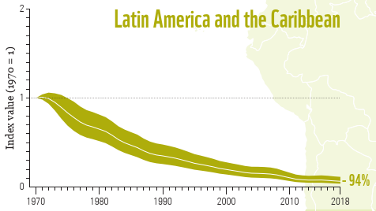

# Living Planet Index for Latin America, 1970–2018

**Source:** WWF (2022b)

## What this indicator measures

The Living Planet Index tracks trends in the abundance of a large number of populations of vertebrate species. The data used in constructing the index are time-series of either population size, density (population size per unit area), abundance (number of individuals per sample) or a proxy of abundance (for example, the number of nests recorded may be used instead of a direct population count). The LPI is currently based on time-series data for 20,811 populations of 4,392 species of mammals, birds, reptiles, amphibians and fish from around the globe. Using a method developed by ZSL and WWF, these species population trends are aggregated and weighted to produce the different Living Planet Indices.

## Key finding

The 94% decline in the LPI for the tropical subregions of the Americas is the most striking result observed in any region. Decline of freshwater populations (i.e. fish, reptiles and amphibians) is behind much of the decline.

## Visual

## Full reference

WWF. (2022b). *Living Planet Report 2022 — Building a nature positive society* (Almond, R.E.A., Grooten, M., Juffe Bignoli, D. & Petersen, T., Eds.). WWF International. https://livingplanet.panda.org/about_the_living_planet_report/
