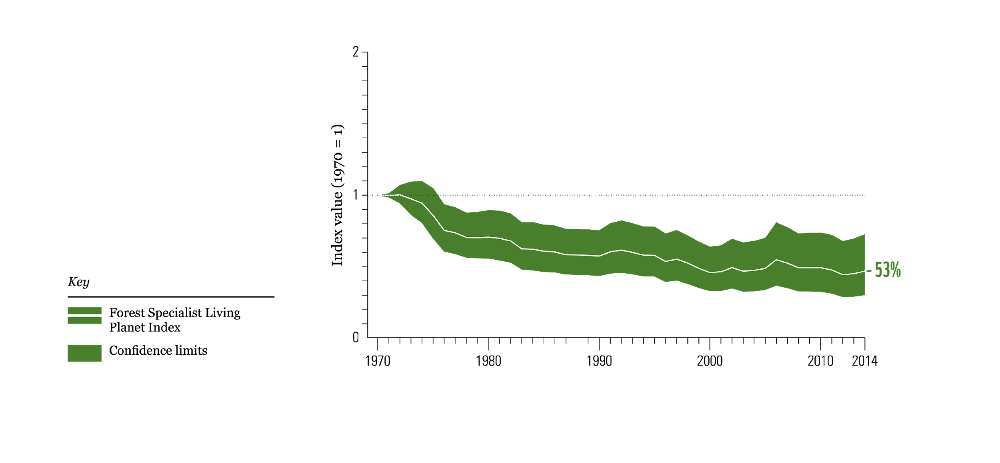

# Living Planet Index for Global Forest Species, 1970–2014

**Source:** WWF (2020)

## What this indicator measures

The Living Planet Index for forest specialist species tracks how populations of species that depend on forest habitat have changed over time. It captures the impact of not just forest cover loss but also changes in forest quality and degradation.

## Key finding

Forest specialist species are particularly impacted by habitat loss and habitat degradation — not only by changes in forest cover but changes in forest quality.

## Visual

## Full reference

WWF. (2020). *Living Planet Report 2020: Bending the curve of biodiversity loss*. WWF. https://www.worldwildlife.org/publications/living-planet-report-2020
