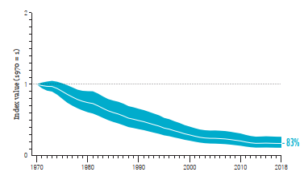

# Living Planet Index for Global Freshwater Species, 1970–2018

**Source:** WWF (2022b)

## What this indicator measures

The Living Planet Index for freshwater species tracks population trends of fish, reptiles, amphibians, and other freshwater-dependent vertebrates globally. It is particularly relevant to the Amazon, which holds one of the world's largest freshwater ecosystems.

## Key finding

The average abundance of freshwater populations across the globe declined by 83% on average. Almost one in three freshwater species are threatened with extinction. Megafauna species (those with body sizes larger than 30kg) like river dolphins in the Amazon are at greater risk of going extinct as they require larger, complex habitats and have fewer offspring. They are subject to overexploitation, indirect casualties from harvest of other freshwater species (namely catfish in the Amazon), and are particularly susceptible to dams which block their migration to nursery and feeding grounds.

## Visual

## Full reference

WWF. (2022b). *Living Planet Report 2022 — Building a nature positive society* (Almond, R.E.A., Grooten, M., Juffe Bignoli, D. & Petersen, T., Eds.). WWF International. https://livingplanet.panda.org/about_the_living_planet_report/
