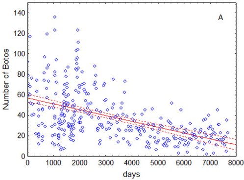
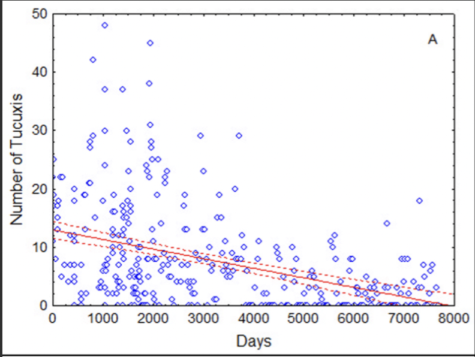

# Population Estimates for Boto and Tucuxi River Dolphins, 1994–2017

**Source:** da Silva et al. (2018)

## What this indicator measures

Results from monthly standardised dolphin surveys between 1994–2017 in the Mamirauá Reserve (Amazon state, Brazil), using a minimum count protocol with identical sampling set-up and effort. The number of dolphins was used as a dependent variable in a generalised linear model (GLM), with time since study begin and water level as independent variables, to understand if dolphin decline was significant over time.

| Dolphin | Time frame | Days | Decline/day | Total (%) |
|---|---|---|---|---|
| Boto | 1994–1999 | 2,000 | 0.00005 | 9.5* |
| Boto | 2000–2017 | 6,000 | 0.00019 | 68.0 |
| Boto | 1994–2017 | 8,000 | 0.00015 | 59.3 |
| Tucuxi | 1994–1999 | 2,000 | 0.00059 | 69.3 |
| Tucuxi | 2000–2017 | 6,000 | 0.00023 | 74.8 |
| Tucuxi | 1994–2017 | 8,000 | 0.00021 | 71.6 |

*Decline was not significant in this period. Total % is own calculation.

## Key finding

Between 1994 and 2017, boto dolphins are estimated to have declined by 60%. The decline before 2000 was significantly different from after. The loss of botos is most likely caused by "both directed and incidental mortality caused by human fisheries." Tucuxis declined by more than 70% between 1994 and 2017. Hunting for this species is almost certainly less intense than for botos, but tucuxis are smaller, less powerful, and less able to escape entanglement in fishing nets. The use of gillnets locally, and in the region as a whole, has increased substantially during the two decades of this study.

## Visuals

## Full reference

da Silva, V. M. F., Freitas, C. E. C., Dias, R. L., & Martin, A. R. (2018). Both cetaceans in the Brazilian Amazon show sustained, profound population declines over two decades. *PLOS ONE*, *13*(5), e0191304. https://doi.org/10.1371/journal.pone.0191304
