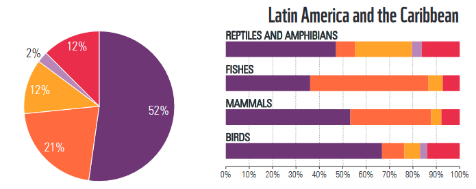
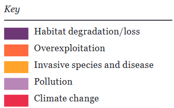

# Regional Threats to Populations in Latin America and the Caribbean

**Source:** Westveer et al. (2022)

## What this indicator measures

This indicator analyses the primary threats driving population decline for vertebrate species in Latin America and the Caribbean. It draws on data from the Living Planet Index dataset to identify which threat categories (habitat degradation, overexploitation, invasive species, etc.) are most prevalent and most severe across taxonomic groups.

## Key finding

Overall, habitat degradation is the main threat to populations in Latin America and the Caribbean. Especially fishes, but also mammals, are furthermore threatened by overexploitation.

## Visuals

## Full reference

Westveer, J., Freeman, R., McRae, L., Marconi, V., Almond, R. E. A., & Grooten, M. (2022). *A Deep Dive into the Living Planet Index* (Living Planet Report No. 18; p. 21). WWF and ZSL. https://wwflpr.awsassets.panda.org/downloads/lpr_2022_technical_supplement_double_page_spreads.pdf
