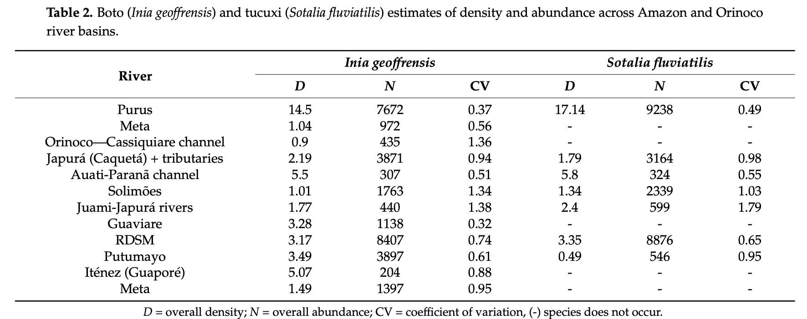

# Abundance and Density of Boto and Tucuxi Dolphins in Amazon and Orinoco River Basins

**Source:** Paschoalini et al., 2021

## What this indicator measures

Abundance and density estimates of Amazonian river dolphins (boto and tucuxi) across the Amazon and Orinoco river basins, compiled from multiple survey datasets.

## Key finding

The study provides density and abundance estimates for boto and tucuxi across six countries. Surveys suggest both species occur at lower densities than historically reported, reflecting ongoing population decline.

## Visual

## Full reference

Paschoalini, M., Trujillo, F., Marmontel, M., Mosquera-Guerra, F., Paitach, R. L., Julião, H. P., dos Santos, G. M. A., Van Damme, P. A., Coelho, A. G. de A., Escobar Wilson White, M., & Zerbini, A. N. (2021). Density and Abundance Estimation of Amazonian River Dolphins: Understanding Population Size Variability. *Journal of Marine Science and Engineering*, *9*(11), 1184. https://doi.org/10.3390/jmse9111184
