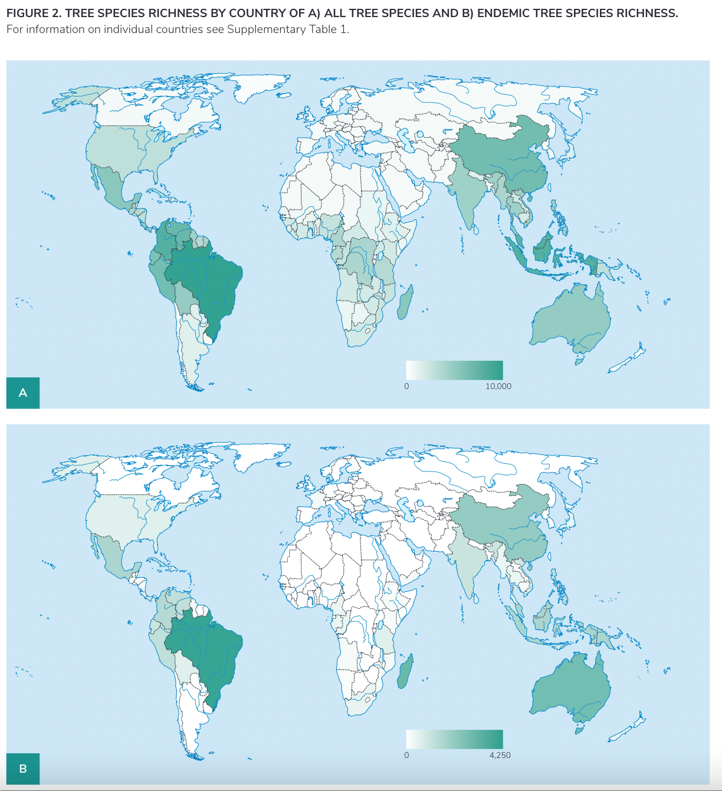

# Global Tree Assessment: Tree Species and Endemic Tree Species Richness

**Source:** BGCI, 2021, 2022

## What this indicator measures

The Global Tree Assessment evaluates the number of tree species and endemic tree species present in each country, including their conservation status.

## Key finding

The Amazon region has some of the highest tree species richness in the world, with four of the top ten countries globally. All Amazon countries have a very high percentage of their tree species protected (at least 78% or better). Brazil ranks highest worldwide in the total number of threatened tree species.

## Visual

## Full reference

Botanic Gardens Conservation International (BGCI). (2021, 2022). *Global Tree Assessment*. BGCI. https://www.bgci.org/our-work/networks-and-initiatives/global-tree-assessment/
