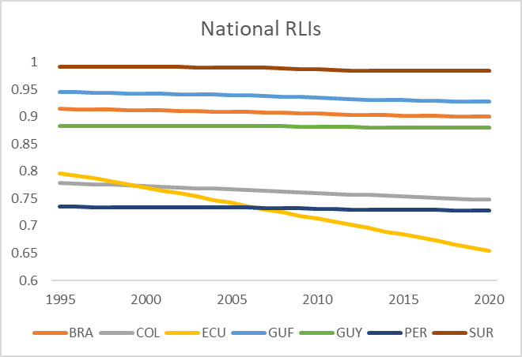

# National Red List Index, 1993–2019

**Source:** IUCN, 2022; Rodrigues et al., 2014

## What this indicator measures

The Red List Index (RLI) measures aggregated survival chances across groups of species, based on genuine changes in the number of species in each category of extinction risk. If RLI = 1, all species qualify as Least Concern. If RLI = 0, all species have gone Extinct. A constant RLI value over time indicates that the overall extinction risk for the group is unchanged.

## Key finding

The Red List Index for Ecuador decreased the most. For many countries the index remained almost stable. No data available for Bolivia.

## Visual

## Full reference

International Union for the Conservation of Nature (IUCN). (2022). *The IUCN Red List of Threatened Species*. https://www.iucnredlist.org/

Rodrigues, A. S. L., Brooks, T. M., Butchart, S. H. M., Chanson, J., Cox, N., Hoffmann, M., & Stuart, S. N. (2014). Spatially Explicit Trends in the Global Conservation Status of Vertebrates. *PLoS ONE*, *9*(11), e113934. https://doi.org/10.1371/journal.pone.0113934
