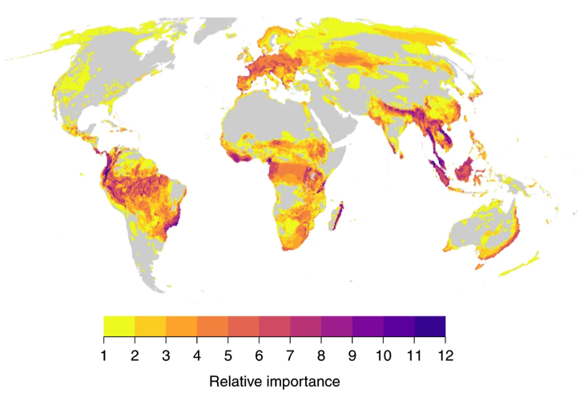
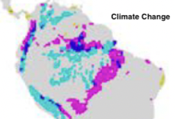
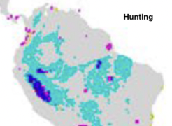
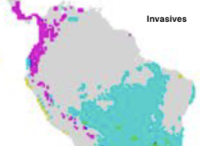
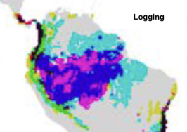
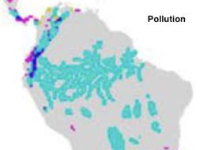
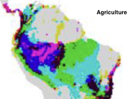
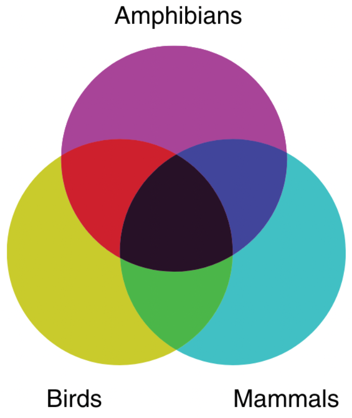

# Global Threat Risk

**Source:** Harfoot et al., 2021

## What this indicator measures

The authors use information from the Red List database regarding species distribution of amphibians, birds and mammals, and threats to these species. Global threat maps for six main threats were simulated: (1) agriculture, (2) hunting and trapping, (3) logging, (4) pollution, (5) invasive species (including pathogens such as chytrid), and (6) climate change. The authors developed a model for threat probability and fitted the parameters towards the simulated threat maps, enabling estimation of where in their range a species is affected by a threat.

## Key finding

The presence of multiple threats to birds, mammals and amphibians makes the Amazon a global threat hotspot. The basin is a priority area for threat mitigation. All six threats have an impact on species in the Amazon. Most threats occur predominantly at the Southern and Western periphery of the landscape. Climate change, however, also affects the more remote center.

## Visual

## Full reference

Harfoot, M. B. J., Johnston, A., Balmford, A., Burgess, N. D., Butchart, S. H. M., Dias, M. P., Hazin, C., Hilton-Taylor, C., Hoffmann, M., Isaac, N. J. B., Iversen, L. L., Outhwaite, C. L., Visconti, P., & Geldmann, J. (2021). Using the IUCN Red List to map threats to terrestrial vertebrates at global scale. *Nature Ecology & Evolution*, *5*(11), 1510–1519. https://doi.org/10.1038/s41559-021-01542-9
