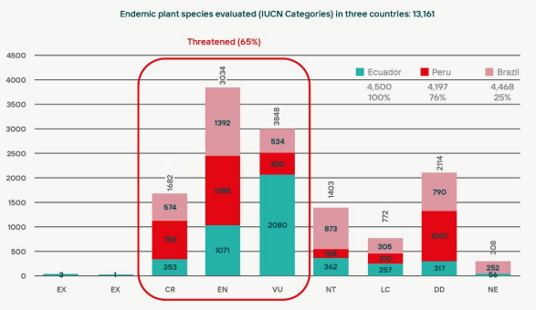

# Endemic Plant Species IUCN Assessment

**Source:** Zapata-Ríos et al., 2021

## What this indicator measures

Assessment of the IUCN Red List status of endemic plant species across Amazon countries (Brazil, Ecuador, Peru). Note: endemic plant species are more relevant for the Cerrado biome (per internal note).

## Key finding

65% of endemic plant species of Brazil, Ecuador and Peru that were evaluated in the IUCN Red List are threatened, meaning they are either Critically Endangered (CR), Endangered (EN) or Vulnerable (VU). For tropical countries overall, the percentage lies at 47%. For 23% of the evaluated endemic plants, data is deficient, meaning the percentage of species at threat could be underestimated.

## Visual

## Full reference

Zapata-Ríos, G., et al. (2021). Chapter 3: Biological diversity and ecological networks in the Amazon. In C. Nobre et al. (Eds.), *Amazon Assessment Report 2021* (1st ed.). UN Sustainable Development Solutions Network (SDSN). https://doi.org/10.55161/DGNM5984
