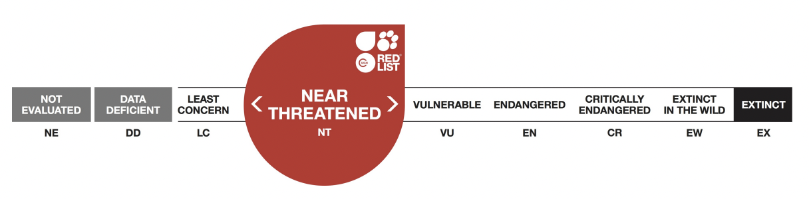

# IUCN Red List Assessment: Jaguar (Panthera onca)

**Source:** IUCN, 2016

## What this indicator measures

IUCN Red List assessment tracking the conservation status of the jaguar (Panthera onca) over time, from 1982 to 2017.

## Key finding

Status history: 1982, 1986, 1988, 1990 — Vulnerable; 1996, 2002, 2008, 2017 — Near Threatened. Suspected 20–25% decline over the past three generations (21 years). Connectivity among jaguar populations is being lost at local and regional scales. Jaguar-livestock conflict is a serious threat reported throughout their range.

## Visual

## Full reference

International Union for the Conservation of Nature (IUCN). (2016). *Panthera onca*. The IUCN Red List of Threatened Species. https://www.iucnredlist.org/
