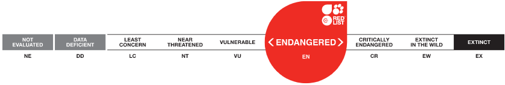

# IUCN Red List Assessment: Boto Dolphin (Inia geoffrensis)

**Source:** IUCN, 2018

## What this indicator measures

IUCN Red List assessment tracking the conservation status of the boto (Amazon river dolphin, Inia geoffrensis) over time.

## Key finding

Status history: 1988, 1990, 1994, 1996 — Vulnerable; 2008, 2011 — Data Deficient; 2018 — Endangered. Suspected reduction of 50% or more in total population size over three generations (75 years). Threats include by-catch in fishing nets, concussive effects from explosive fishing, habitat loss and degradation from dams, mining, oil and shipping, environmental pollution, and deliberate killing for use as fishing bait since 2000.

## Visual

## Full reference

International Union for the Conservation of Nature (IUCN). (2018). *Inia geoffrensis*. The IUCN Red List of Threatened Species. https://www.iucnredlist.org/
