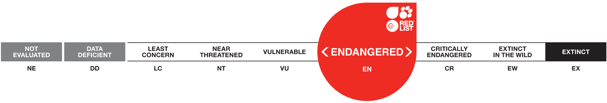

# IUCN Red List Assessment: Tucuxi Dolphin (Sotalia fluviatilis)

**Source:** IUCN, 2020

## What this indicator measures

IUCN Red List assessment tracking the conservation status of the tucuxi dolphin (Sotalia fluviatilis) over time.

## Key finding

Status history: 2010, 2012 — Data Deficient; 2020 — Endangered. Range-wide population reduction of 50% or more over three generations, where the causes of the reduction have not ceased. Threats are the same as for the boto, but tucuxi are less often targeted for fishing bait.

## Visual

## Full reference

International Union for the Conservation of Nature (IUCN). (2020). *Sotalia fluviatilis*. The IUCN Red List of Threatened Species. https://www.iucnredlist.org/
