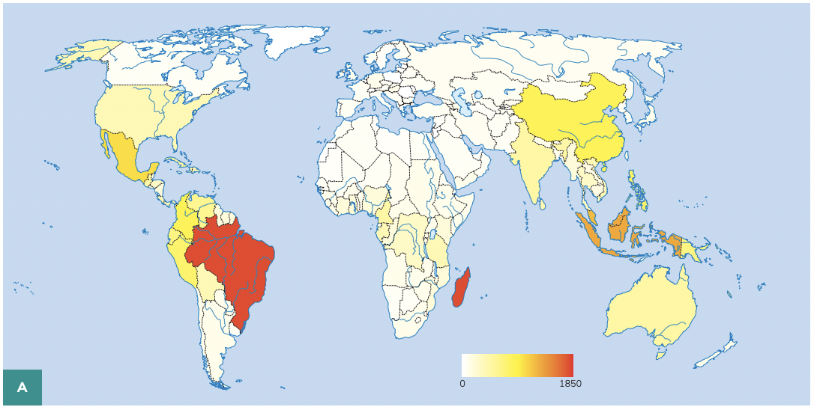

# Threatened Tree Species Richness by Country, 2021

**Source:** BGCI, 2021, 2022

## What this indicator measures

Country-level data on the number and proportion of tree species that are threatened with extinction, from the Global Tree Assessment.

## Key finding

Brazil ranks highest in the world in the absolute number of threatened tree species. Madagascar has the highest share of threatened tree species. Among Amazon countries, Brazil (20%), Peru (17%), Ecuador (18%), Colombia (not listed), Bolivia (11%), Guyana (8%), French Guiana (10%), and Suriname (8%) have varying proportions of their tree species threatened.

## Visual

## Full reference

Botanic Gardens Conservation International (BGCI). (2021, 2022). *Global Tree Assessment*. BGCI. https://www.bgci.org/our-work/networks-and-initiatives/global-tree-assessment/
