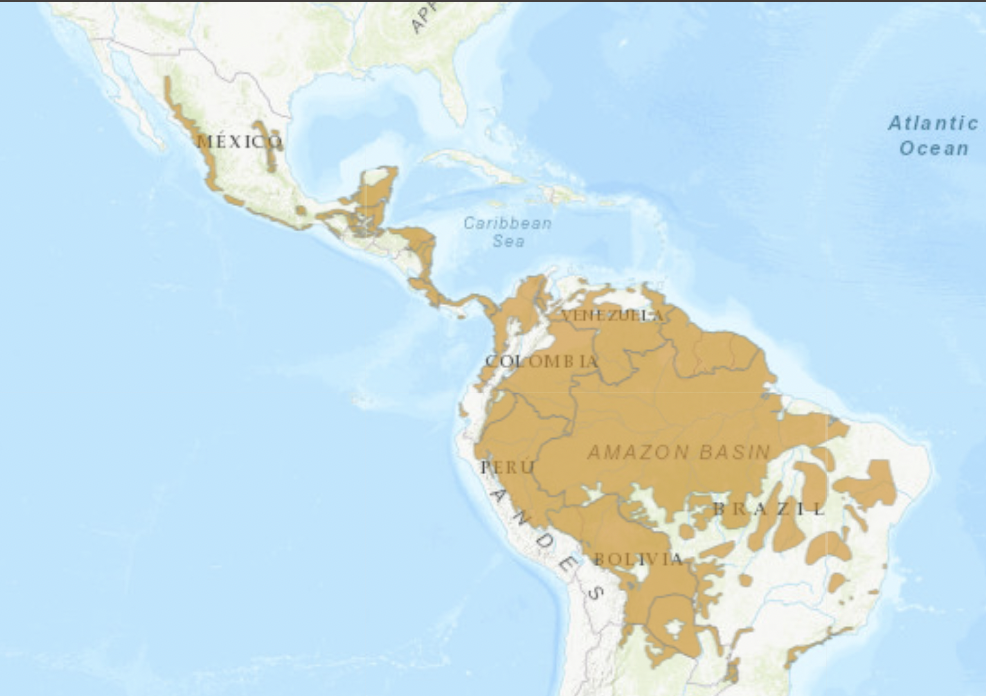

# Jaguar (Panthera onca) Range

**Source:** IUCN, 2016

## What this indicator measures

Map of the current and historical range of the jaguar (Panthera onca), showing extent of occurrence and stronghold areas.

## Key finding

The current extent of occurrence of the Panthera onca is estimated at 47% of its historical range. Its stronghold is still the Amazon basin, which comprises 57% of its total extent. The jaguar has been virtually eliminated from much of the drier northern parts of its range.

## Visual

## Full reference

International Union for the Conservation of Nature (IUCN). (2016). *Panthera onca*. The IUCN Red List of Threatened Species. https://www.iucnredlist.org/
