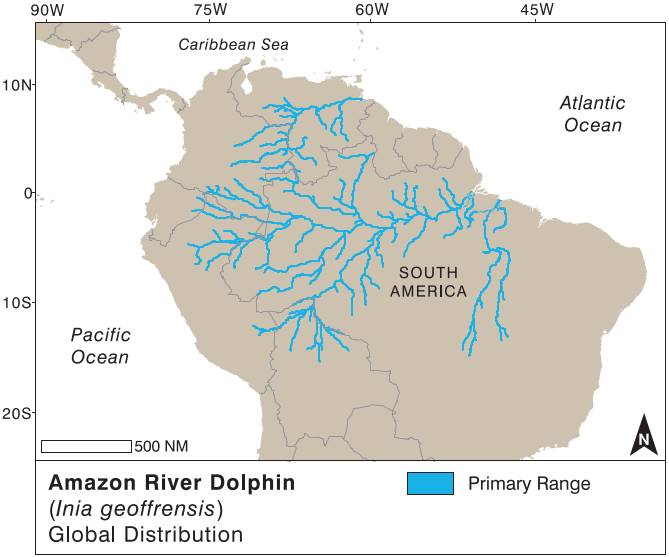

# Amazon River Dolphin (Inia geoffrensis) Range

**Source:** da Silva & Martin, 2018

## What this indicator measures

Map of the range of the Amazon river dolphin (boto, Inia geoffrensis) across South America.

## Key finding

The boto occurs almost everywhere it can physically reach without venturing into marine waters. It occurs in six countries — Bolivia, Brazil, Colombia, Ecuador, Peru, and Venezuela — in an area of about 7 million km2. It can be found along the entire Amazon River and its principal tributaries, smaller rivers and lakes. Expansion of its range is limited by impassable waterfalls and very shallow waters. However, during extreme high water levels some falls are flooded, allowing up- and downstream movements.

## Visual

## Full reference

da Silva, V. M. F., & Martin, A. R. (2018). Amazon River Dolphin. In *Encyclopedia of Marine Mammals* (pp. 21–24). Elsevier. https://doi.org/10.1016/B978-0-12-804327-1.00044-3
