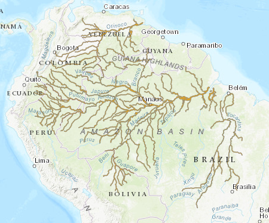

# Amazon River Dolphin (Inia geoffrensis) Range — IUCN Modelled

**Source:** IUCN, 2018

## What this indicator measures

Modelled distribution map showing where the Amazon river dolphin occurs or may occur, based on IUCN data.

## Key finding

The map shows the modelled occurrence probability of the boto across the Amazon basin, confirming its broad distribution across the river system.

## Visual

## Full reference

International Union for the Conservation of Nature (IUCN). (2018). *Inia geoffrensis*. The IUCN Red List of Threatened Species. https://www.iucnredlist.org/
