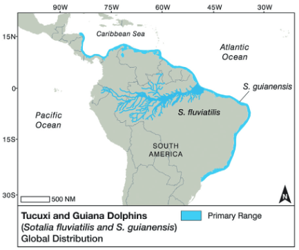

# Tucuxi Dolphin (Sotalia fluviatilis) Range

**Source:** Flores et al., 2018

## What this indicator measures

Map of the range of the tucuxi dolphin (Sotalia fluviatilis) across the Amazon basin.

## Key finding

The tucuxi occurs in the main tributaries of the Amazon/Solimões River basin in Brazil as far inland as southeastern Colombia, eastern Ecuador, and northeastern Peru, with records in all three types of river water in the region. Several rivers contain impassable falls, rapids, and shallow waters. Tucuxis do not go into flooded forest as does the sympatric boto, but the two species share a preference for areas with reduced current and waterway junctions.

## Visual

## Full reference

Flores, P. A. C., da Silva, V. M. F., & Fettuccia, D. de C. (2018). Tucuxi and Guiana Dolphins. In *Encyclopedia of Marine Mammals* (pp. 1024–1027). Elsevier. https://doi.org/10.1016/B978-0-12-804327-1.00264-8
