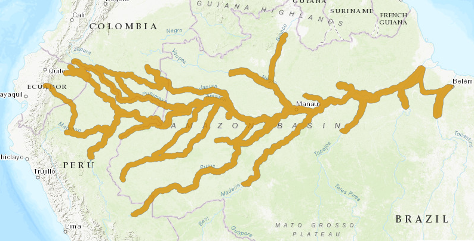

# Tucuxi Dolphin (Sotalia fluviatilis) Range — IUCN Modelled

**Source:** IUCN, 2020

## What this indicator measures

Modelled distribution map of the tucuxi dolphin based on IUCN data.

## Key finding

The map confirms the tucuxi's distribution across the main Amazon basin tributaries, with a more restricted range than the boto.

## Visual

## Full reference

International Union for the Conservation of Nature (IUCN). (2020). *Sotalia fluviatilis*. The IUCN Red List of Threatened Species. https://www.iucnredlist.org/
