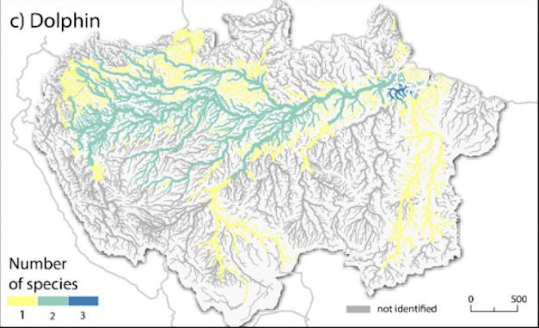

# Population Distribution of River Dolphins

**Source:** WWF US, in press

## What this indicator measures

Modelled distribution of all three river dolphin species (boto, tucuxi, and a third species) combined in a single map across the Amazon basin. Note: this source is in press at the time of publication (draft in Zotero).

## Key finding

The combined modelled distribution shows where each of the three river dolphin species occurs or is predicted to occur across the Amazon basin.

## Visual

## Full reference

WWF US. (in press). *Identifying the current and future status of freshwater connectivity corridors in the Amazon Basin*. WWF US.
