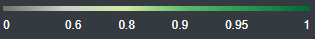
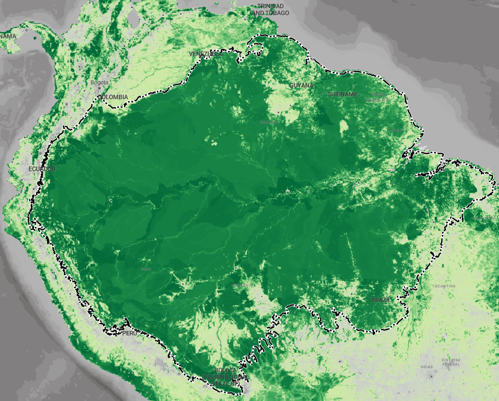
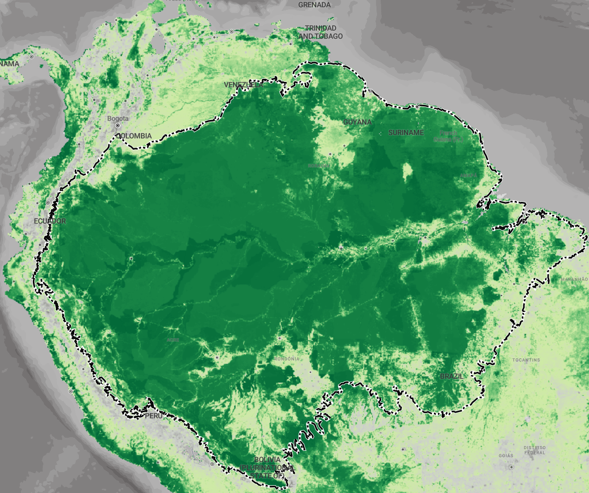
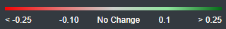
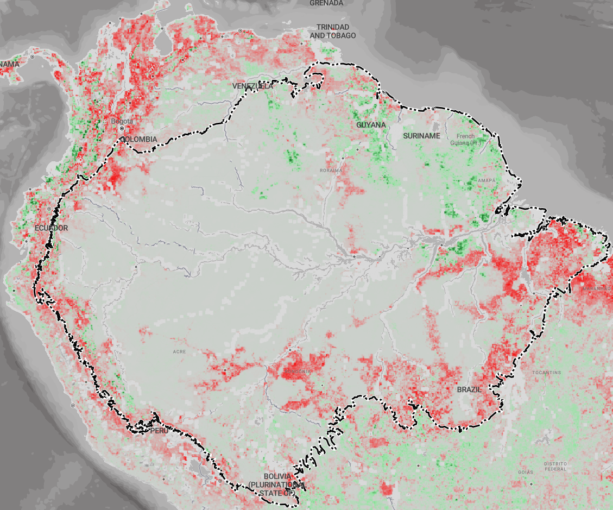

# Biodiversity Intactness Index

**Source:** Newbold et al., 2016

## What this indicator measures

The Biodiversity Intactness Index measures the average proportion of natural biodiversity remaining in local ecosystems. It is based on modelled changes in abundance of species in terrestrial environments, as a response to anthropogenic pressures (land use, etc.) relative to an inferred baseline with minimal human impacts. A score of 1 indicates no loss in species from the baseline ecosystem to the current ecosystem.

## Key finding

Biodiversity intactness is high, especially for the northern parts of the Amazon. Between 2000 and 2015, loss occurred mostly in the South (outside of protected areas).

## Visual

## Full reference

Newbold et al., T. (2016). *Global map of the Biodiversity Intactness Index, from Newbold et al. (2016) Science* [ZIP]. Natural History Museum. https://doi.org/10.5519/0009936
