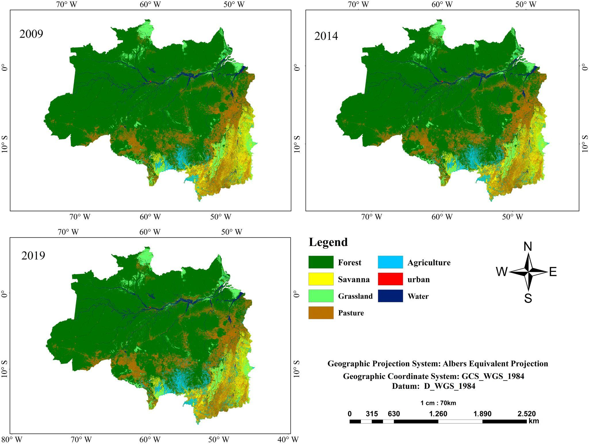

# Land Use and Land Cover, 2009, 2014 and 2019

**Source:** da Silva Cruz et al., 2022

## What this indicator measures

Modelled land use/land cover, taking into account 7 classes: forest, savanna, grassland, pasture, agriculture, urban, and water. Analysis by sub-basin across the Amazon.

## Key finding

The larger changes in land cover occurred in the Xingu, Tapajós, and Madeira River sub-basins, which lie on the right bank of the Amazon River, mainly in the region called the Arc of Deforestation. Forest cover decreased by about 3.7% and agricultural areas increased by 70.6% between 2009 and 2019 across the Amazon region.

## Visual

## Full reference

da Silva Cruz, J., Blanco, C. J. C., & de Oliveira Júnior, J. F. (2022). Modeling of land use and land cover change dynamics for future projection of the Amazon number curve. *Science of The Total Environment*, *811*, 152348. https://doi.org/10.1016/j.scitotenv.2021.152348
