# MapBiomas Amazônia Land Cover 1985–2020

**Source:** MapBiomas, 2022

## What this indicator measures

Land cover classification based on Landsat imagery at 30x30m2 resolution, covering the full Amazon region and broken down by country. Seven land cover classes tracked: forest, savanna, grassland, pasture, agriculture, urban, and water.

## Key finding

In the whole Amazon, forest cover decreased by about 10% and agricultural areas increased by 2.5 times between 1985 and 2020. Most agricultural areas were developed on former forested land, followed by savannah. Bolivia saw forest cover decrease by 10% and agricultural area increase by 560%. Brazil saw forest area decrease by 13% and agricultural area increase by 260%. Colombia saw forest area decrease by 5% and agricultural area increase by 215%.

## Visual

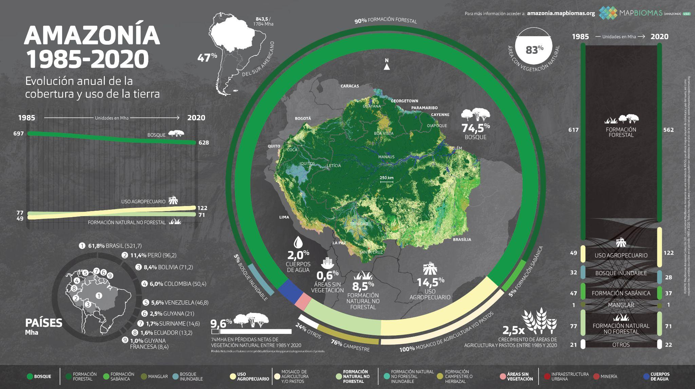

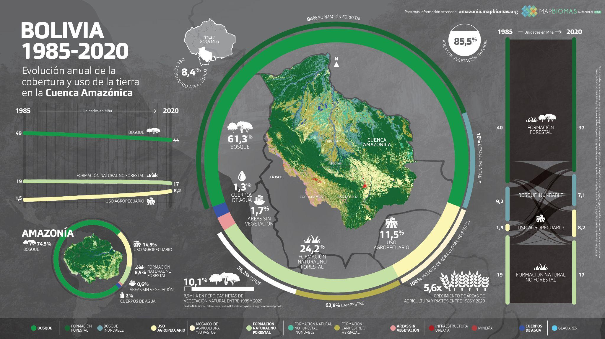

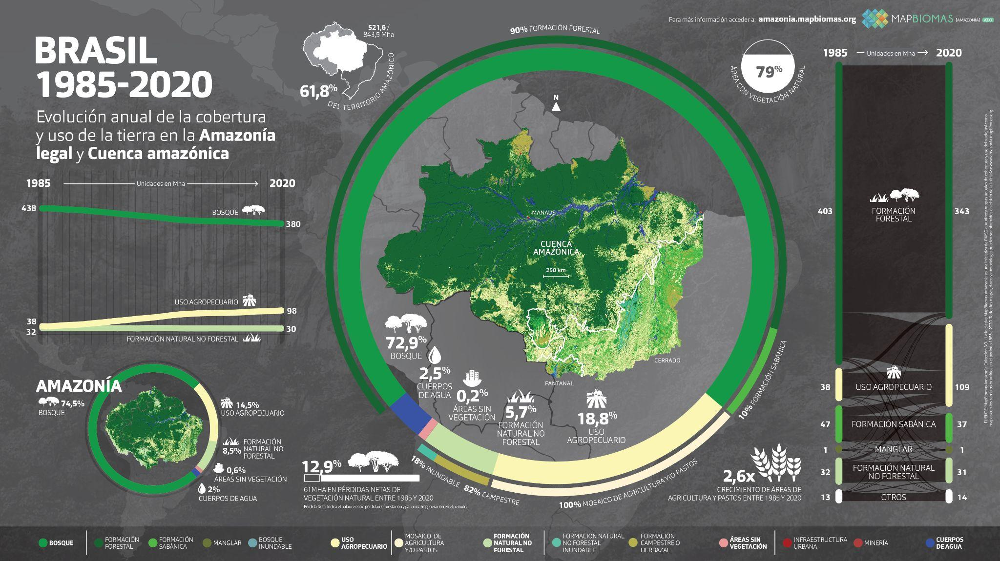

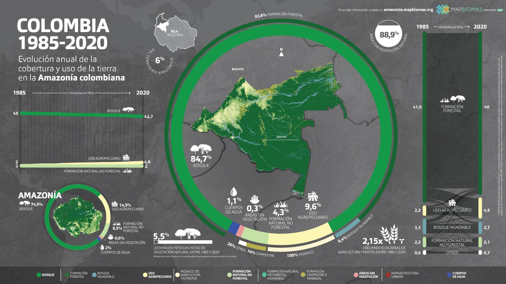

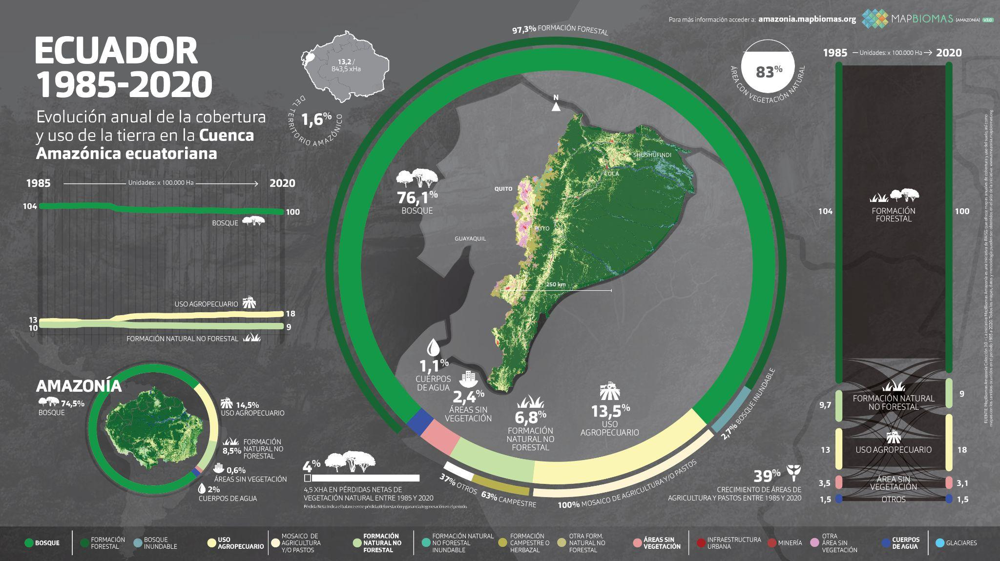

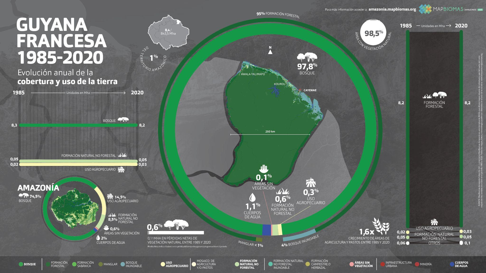

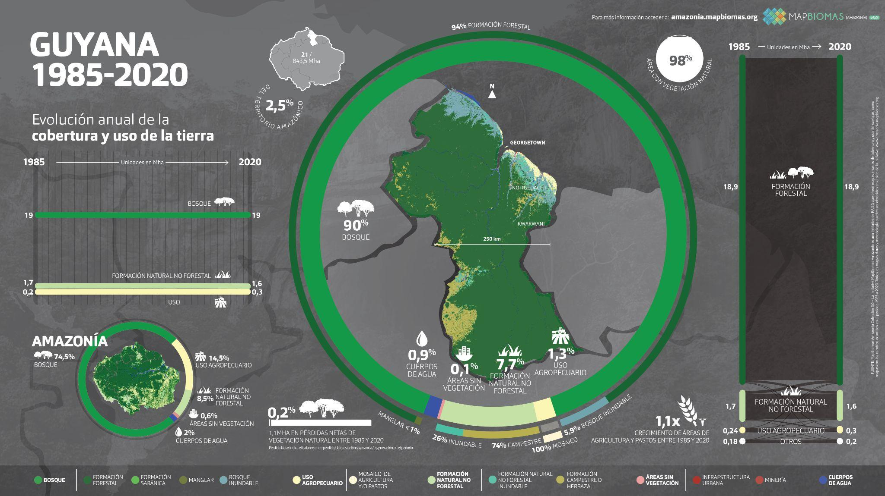

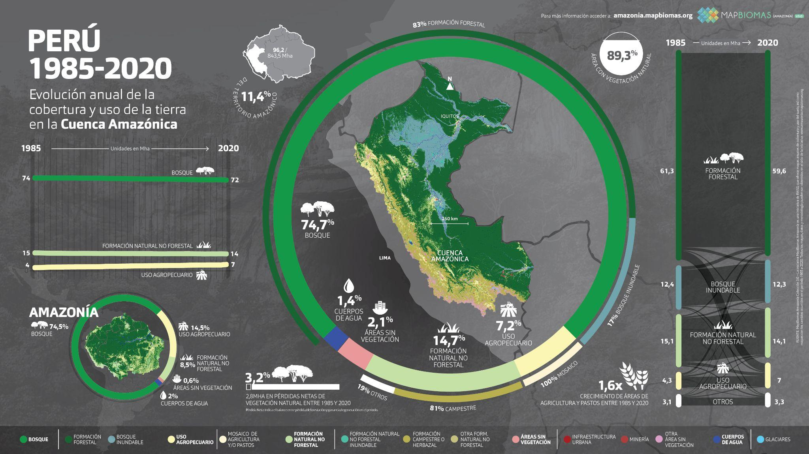

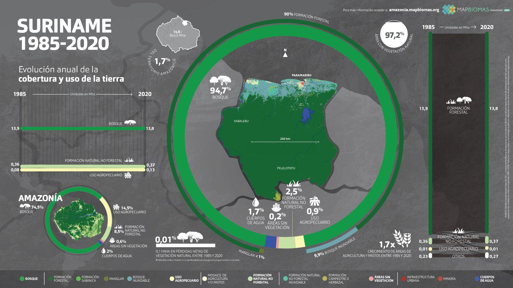

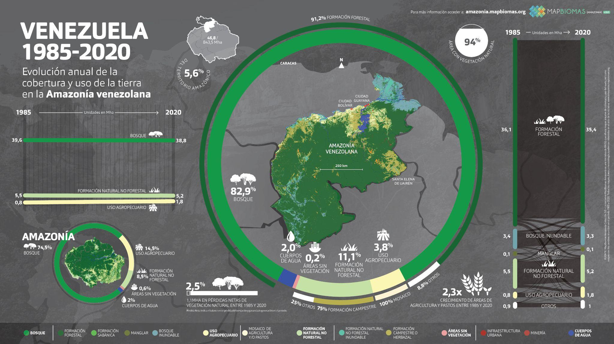

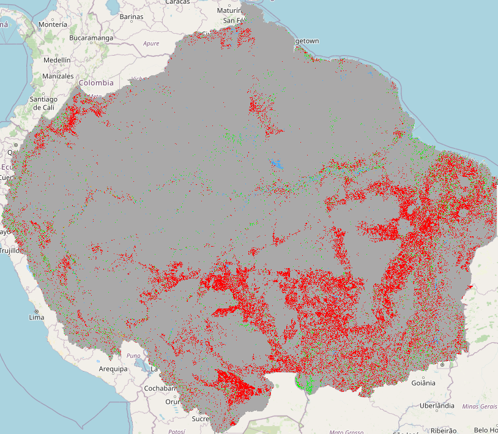

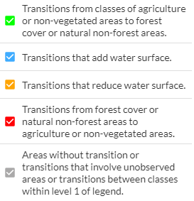

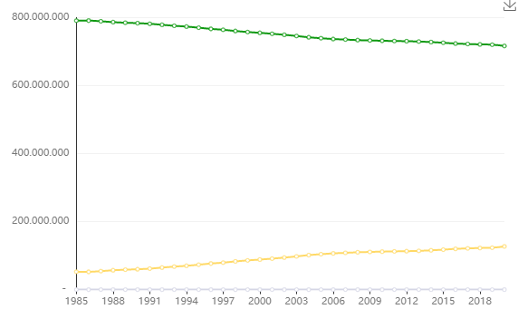

## Full reference

MapBiomas. (2022). *MapBiomas Amazônia*. https://amazonia.mapbiomas.org/
