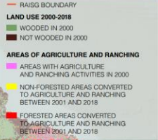
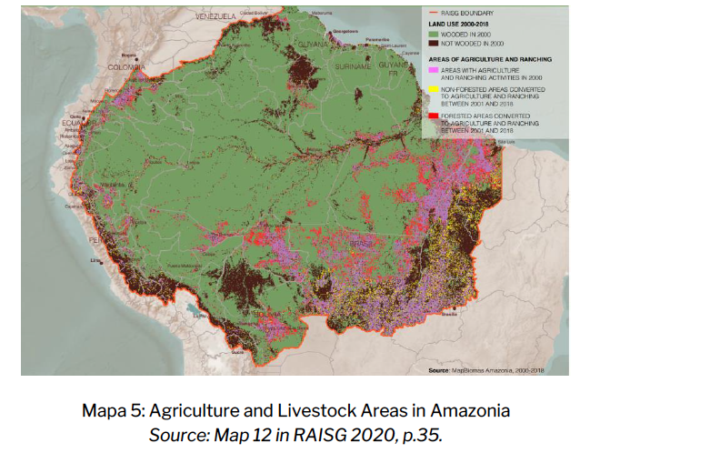

# Agriculture and Livestock Areas in Amazonia, 2001–2018

**Source:** Quintanilla et al., 2022

## What this indicator measures

Mapping of agriculture and livestock areas across Amazonia between 2001 and 2018, showing the expansion of these land uses.

## Key finding

The cattle industry is the biggest driver of deforestation in the Amazon. Leather is a lucrative industry for Brazil — in 2020 it accounted for $1.1 billion in slaughterhouse revenue. 80% of bovine leather produced in Brazil is linked to nearly 100 well-known fashion brands. Deforestation caused by cattle ranching in the Amazon rainforest represents almost 2% of annual global CO2 emissions.

## Visual

## Full reference

Quintanilla, M., Guzman Leon, A., & Josse, C. (2022). *The Amazon against the clock: A regional assessment on where and how to protect 80% by 2025*. COICA, RAISG and stand.earth. https://amazonia80x2025.earth/wp-content/uploads/2022/09/Informe-Regional-Full-Version-ENG-vsf.docx.pdf
