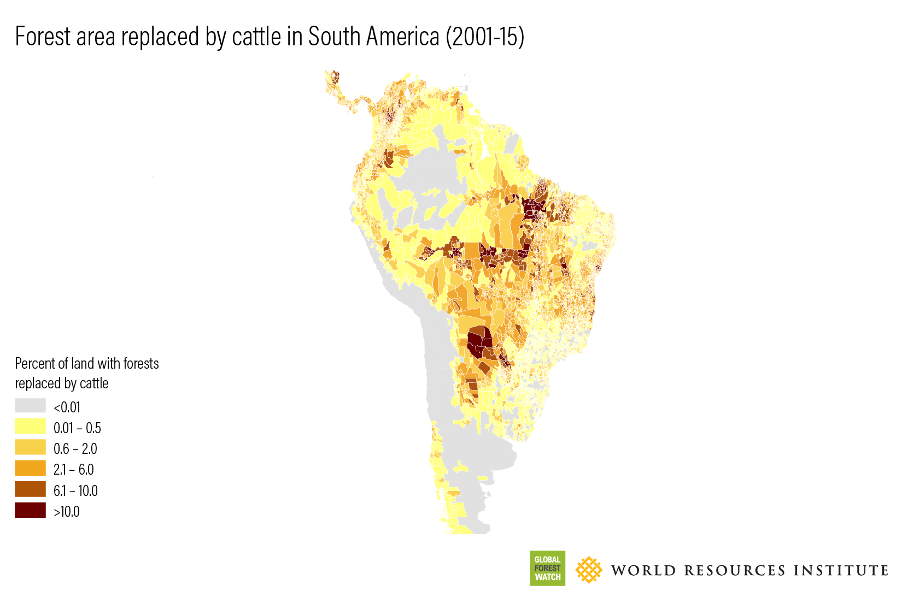
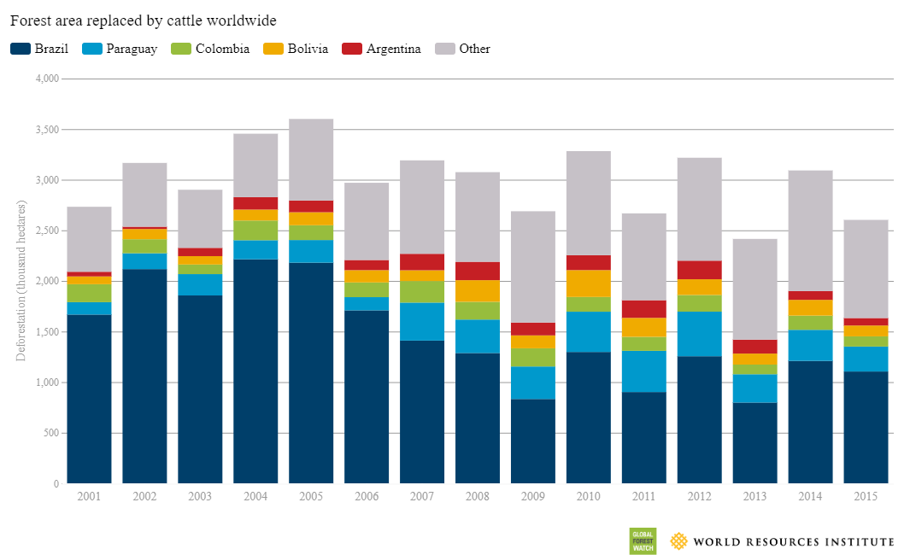

# Forest Area Replaced by Cattle in South America, 2001–2015

**Source:** Goldman et al., 2020

## What this indicator measures

Maps showing the area of forest replaced by cattle as a proportion of each second administrative level's total land area across South America.

## Key finding

Much of this deforestation occurred in Brazil (21.8 Mha, or 48%), followed by Paraguay (9%) and Colombia (5%). The states of Pará and Mato Grosso in Brazil experienced the greatest area of forest replaced by cattle, with around 5 Mha each between 2001 and 2015. In Brazil, just over half of the country's total tree cover loss area between 2001 and 2015 was deforestation for pasture; 70% of this deforestation occurred in the Brazilian Amazon.

## Visual

## Full reference

Goldman, E., Weisse, M., Harris, N., & Schneider, M. (2020, November 12). *Estimating the Role of Seven Commodities in Agriculture-Linked Deforestation: Oil Palm, Soy, Cattle, Wood Fiber, Cocoa, Coffee, and Rubber*. World Resources Institute. https://research.wri.org/gfr/forest-extent-indicators/deforestation-agriculture
