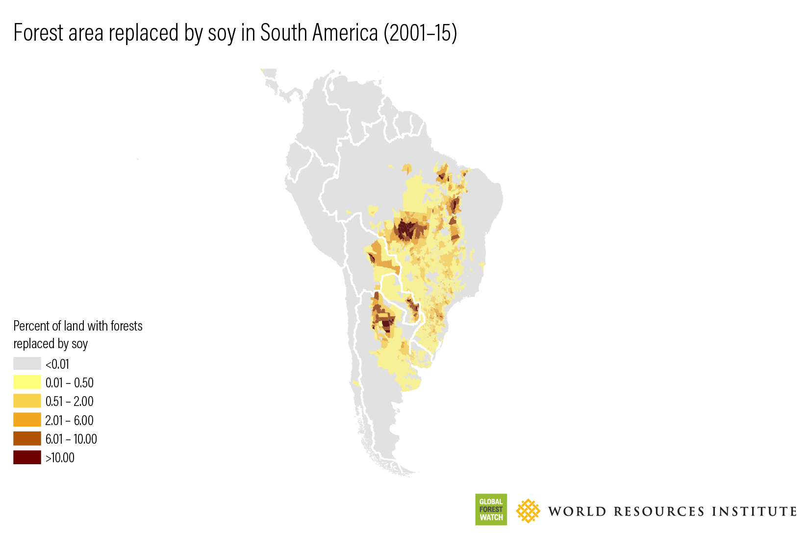
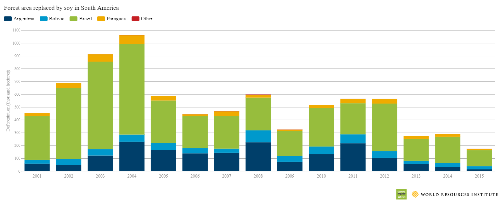

# Forest Replaced by Soy in South America, 2001–2015

**Source:** Goldman et al., 2020

## What this indicator measures

Maps showing the area of forest replaced by soy cultivation across South America, distinguishing direct and indirect deforestation.

## Key finding

In 2019, soy replaced 49,000 hectares of forest in Bolivia, accounting for 80% of the entire soy expansion area in the country. In the Brazilian Amazon, research suggests that soy contributes indirectly to large areas of deforestation through displacement of cattle ranching. The drop in forest area replaced by soy during the early 2000s coincides with Brazil's federal plan to reduce deforestation rates (2004), a dip in soybean profitability (2005–7), and the industry-led soy moratorium.

## Visual

## Full reference

Goldman, E., Weisse, M., Harris, N., & Schneider, M. (2020, November 12). *Estimating the Role of Seven Commodities in Agriculture-Linked Deforestation: Oil Palm, Soy, Cattle, Wood Fiber, Cocoa, Coffee, and Rubber*. World Resources Institute. https://research.wri.org/gfr/forest-extent-indicators/deforestation-agriculture
