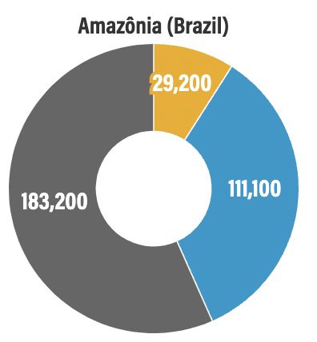
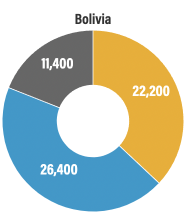
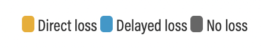

# Direct and Indirect Forest Loss from Soy Expansion, 2019

**Source:** Schneider, Goldman et al., 2021

## What this indicator measures

Map showing direct and indirect forest loss attributable to soy expansion in 2019. Gray = new soy in non-forested areas; Yellow = direct forest conversion; Blue = delayed use of cleared forest land for soy.

## Key finding

In the Brazilian Amazon only 39% of soy-related deforestation is direct. Research suggests that soy contributes indirectly to large areas of deforestation through displacement of pasture, which may in turn result in further deforestation.

## Visual

## Full reference

Schneider, M., Goldman, L., Weisse, M., Amaral, L., & Calado, L. (2021, December 3). *The Commodity Report: Soy Production's Impact on Forests in South America*. Global Forest Watch Blog. https://www.globalforestwatch.org/blog/commodities/soy-production-forests-south-america/
