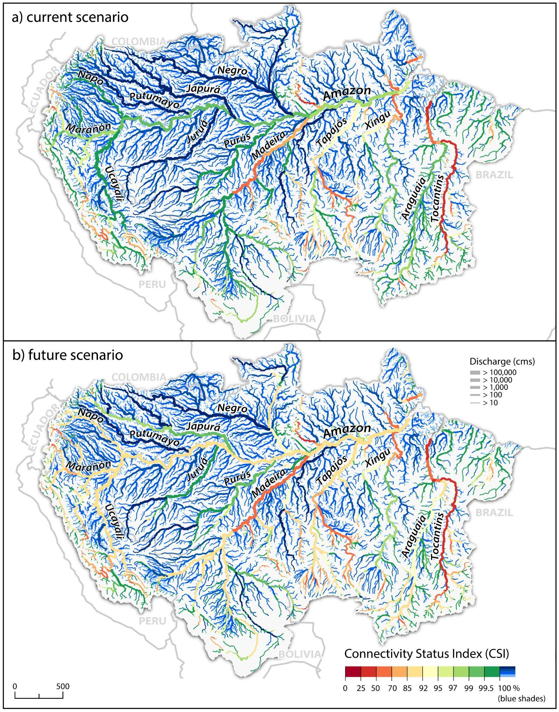

# Free-Flowing River Fragmentation Status

**Source:** Grill et al., 2019

## What this indicator measures

Connectivity status classified by percentage of volume that is free-flowing (blue), good-connectivity <95% (green) or impacted (red) <93%. Calculations are based on HydroSHEDS level 6 basins and river reaches of order.

## Key finding

Eight of the ten longest free-flowing rivers in South America are located within the Amazon Basin. In 2019, 16 of 26 very long (>1,000 km) rivers are free-flowing, but only nine would remain free-flowing if all proposed dams are built. Among long and very long rivers (>500 km), 65% are considered free-flowing corridors. Under the future scenario, one quarter of these long and very long free-flowing corridors — those critical for long-distance migrants and dolphins — would lose their status.

## Visual

## Full reference

Grill, G., Lehner, B., Thieme, M., Geenen, B., Tickner, D., Antonelli, F., Babu, S., Borrelli, P., Cheng, L., Crochetiere, H., Ehalt Macedo, H., Filgueiras, R., Goichot, M., Higgins, J., Hogan, Z., Lip, B., McClain, M. E., Meng, J., Mulligan, M., … Zarfl, C. (2019). Mapping the world's free-flowing rivers — Corrected version. *Nature*, *569*(7755), 215–221. https://doi.org/10.1038/s41586-019-1111-9
