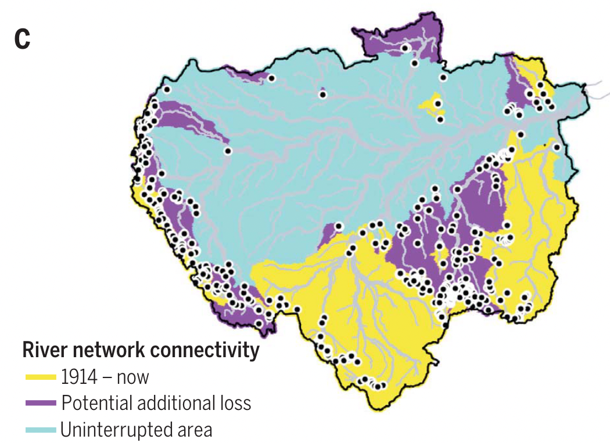
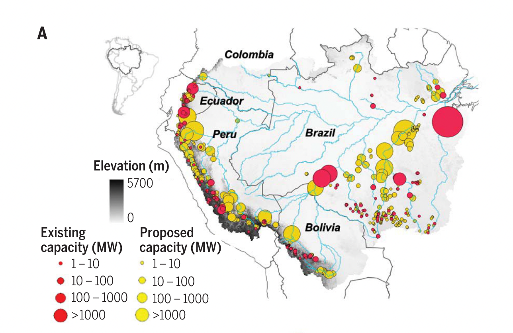
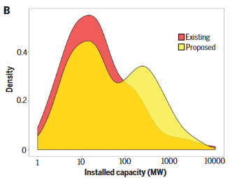
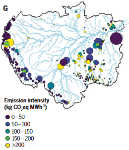

# Impact of Hydropower Expansion

**Source:** Flecker et al., 2022

## What this indicator measures

Analysis of existing and proposed hydropower dam impacts on Amazon river network connectivity. Existing dams have disconnected large fractions of the Amazon (yellow areas). Building all proposed dams would further disrupt Amazon basin connectivity (purple areas), with only about half of the basin remaining unfragmented (cyan areas).

## Key finding

River connectivity throughout the Amazon remained relatively intact until recently, with a loss of <10% between 1914 and 2012. However, the blockage of major tributaries by construction of two large dams on the Madeira River and the Belo Monte dam on the Xingu River has led to abrupt and steep declines in river connectivity. These three projects have increased fragmentation of the Amazon River network by nearly 40% in the past decade alone.

## Visual

## Full reference

Flecker, A. S., et al. (2022). Reducing adverse impacts of Amazon hydropower expansion. *Science*, *375*(6582), 753–760. https://doi.org/10.1126/science.abj4017
