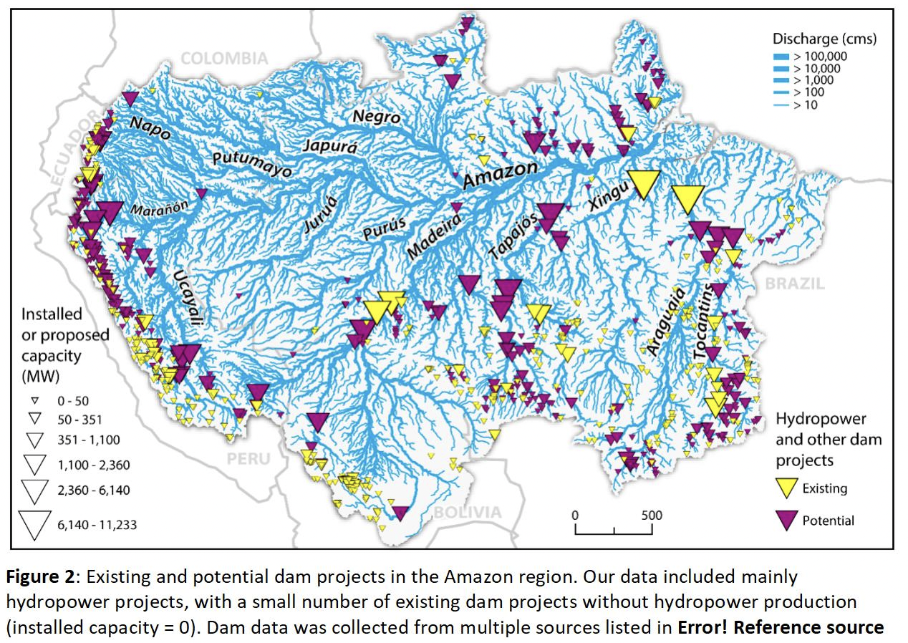

# Existing and Potential Dam Projects in the Amazon Region

**Source:** WWF US, in press

## What this indicator measures

Spatial distribution of 158 existing hydropower dams in the Amazon basin and 351 additional proposed dams. Note: source is in press at time of publication.

## Key finding

Existing dams are primarily located on small-medium rivers, with relatively less impact. The future scenario — with fewer but larger dams on longer, more important river reaches — is a particular concern for migratory species conservation. The current trajectory will leave only three free-flowing tributaries in the next few decades if all 277 planned dams are completed.

## Visual

## Full reference

WWF US. (in press). *Identifying the current and future status of freshwater connectivity corridors in the Amazon Basin*. WWF US.
