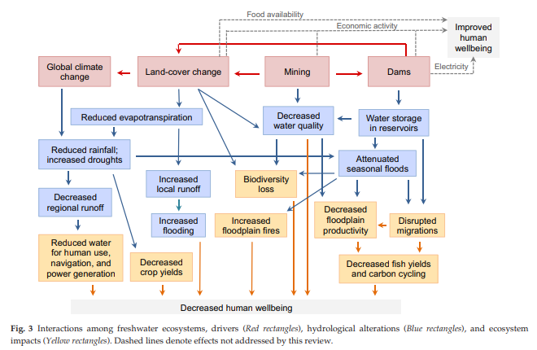

# Impacts on Freshwater Ecosystems and Consequences

**Source:** Castello & Macedo, 2016

## What this indicator measures

Literature review developing a framework that supports the understanding of linkages between Amazon freshwater ecosystems, drivers of hydrological alteration, ecosystem responses and feedbacks, and the role of management policies.

## Key finding

Land-cover changes driven by mining, dam and road construction, agriculture and cattle ranching have already affected approximately 20% of the Basin and up to approximately 50% of riparian forests in some regions. These activities are rapidly degrading freshwater ecosystems, both independently and via complex feedbacks and synergistic interactions. Ecosystem impacts include biodiversity loss, warmer stream temperatures, stronger and more frequent floodplain fires, and changes to biogeochemical cycles, transport of materials, and freshwater community structure and function.

## Visual

## Full reference

Castello, L., & Macedo, M. N. (2016). Large-scale degradation of Amazonian freshwater ecosystems. *Global Change Biology*, *22*(3), 990–1007. https://doi.org/10.1111/gcb.13173
