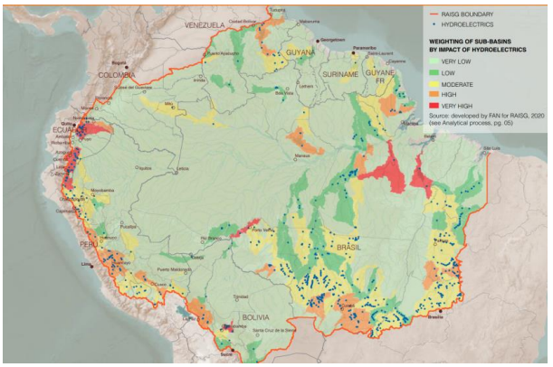

# Vulnerability of Hydrological Systems due to Hydroelectric Infrastructures

**Source:** Quintanilla et al., 2022

## What this indicator measures

Map showing the location of current and planned hydroelectric projects and the impact or level of vulnerability of hydrological systems. High vulnerability is defined when ecological systems are prone to higher levels of drought; medium vulnerability refers to basins with high generation of emissions or areas subject to greater pressure.

## Key finding

Although half of the hydroelectric plants are in Brazil, Ecuador (representing less than 2% of the Amazon) concentrates 18% of the hydroelectric plants in the region. The density of hydroelectric plants in the headwaters is of great concern given that they feed the Amazon River and their location affects the entire basin.

## Visual

## Full reference

Quintanilla, M., Guzman Leon, A., & Josse, C. (2022). *The Amazon against the clock*. COICA, RAISG and stand.earth.
