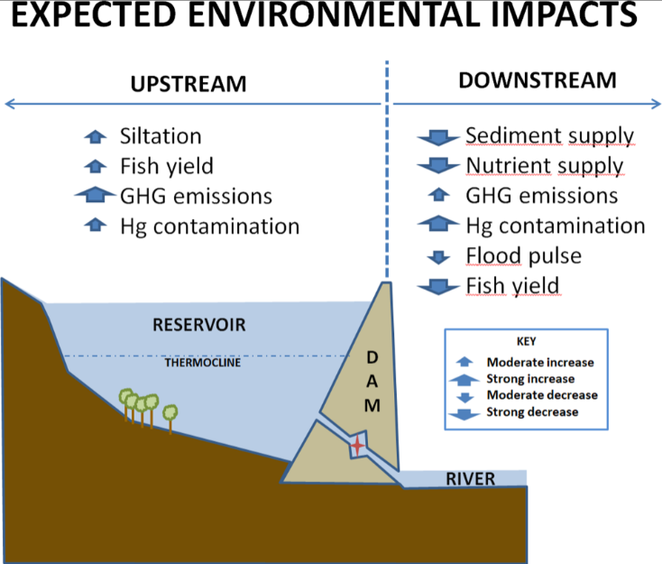

# Environmental Impacts of Dams in the Amazon

**Source:** Forsberg et al., 2017

## What this indicator measures

Summary graph from a study estimating the impacts of six planned hydrological dams in the Andean highlands on different environmental factors. Estimates based on historic data, data from tributaries, technical information and mathematical calculations.

## Key finding

While hydropower is often viewed as a less carbon-intensive energy source, some reservoirs emit as much greenhouse gases as the equivalent energy generation from fossil fuels. The Coca-Codo Sinclair hydropower plant, built in an area assessed as risky, causes acute regressive erosion resulting in almost-weekly ruptures of the trans-Ecuadorian crude oil pipeline.

## Visual

## Full reference

Forsberg, B. R., Melack, J. M., Dunne, T., Barthem, R. B., Goulding, M., Paiva, R. C. D., Sorribas, M. V., Silva, U. L., & Weisser, S. (2017). The potential impact of new Andean dams on Amazon fluvial ecosystems. *PLOS ONE*, *12*(8), e0182254. https://doi.org/10.1371/journal.pone.0182254
