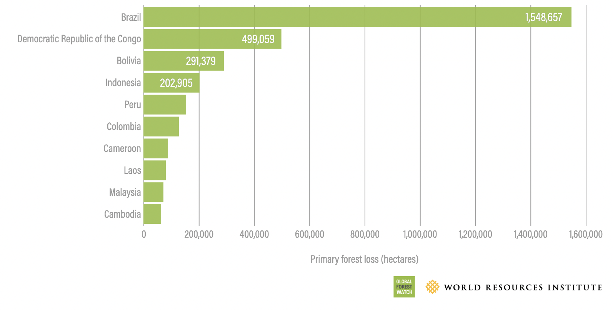

# Top Countries for Tropical Primary Forest Loss in 2021

**Source:** Weisse & Goldman, 2022

## What this indicator measures

Ranking of countries by tropical primary forest loss in 2021.

## Key finding

Brazil has the most primary rainforest, but also the most tropical primary forest loss, with 40% of the global loss in 2021 occurring in the country — a total of 1.5 million hectares. Next to Brazil, Bolivia, Peru and Colombia are among the top 10 countries for tropical primary forest loss.

## Visual

## Full reference

Weisse, M., & Goldman, L. (2022, April 28). What Happened to Forests in 2021? *Global Forest Watch and World Resources Institute*. https://www.globalforestwatch.org/blog/data-and-research/global-tree-cover-loss-data-2021/
