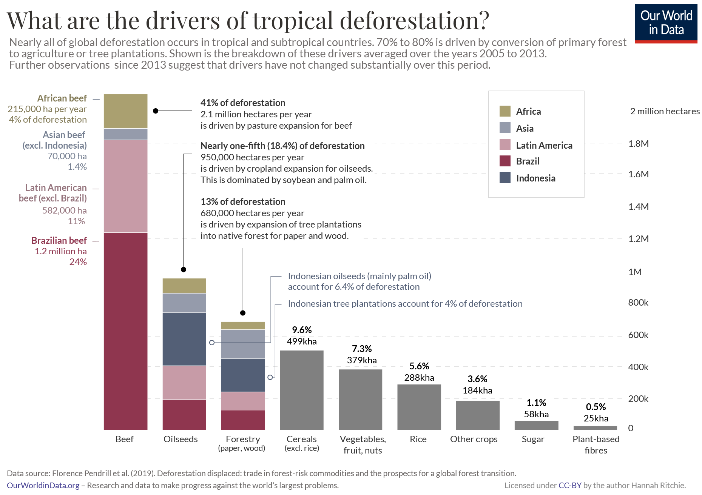

# Global Drivers of Tropical Deforestation, 2005–2011

**Source:** Ritchie & Roser, 2021

## What this indicator measures

Analysis of the main drivers of tropical deforestation globally, broken down by commodity and region.

## Key finding

Brazilian beef accounts for 24% of global tropical deforestation, more than double the rest of Latin America. Brazilian exports of oilseed from soybean and forestry products are also prominent drivers.

## Visual

## Full reference

Ritchie, H., & Roser, M. (2021). Drivers of Deforestation. *Our World in Data*. https://ourworldindata.org/drivers-of-deforestation
