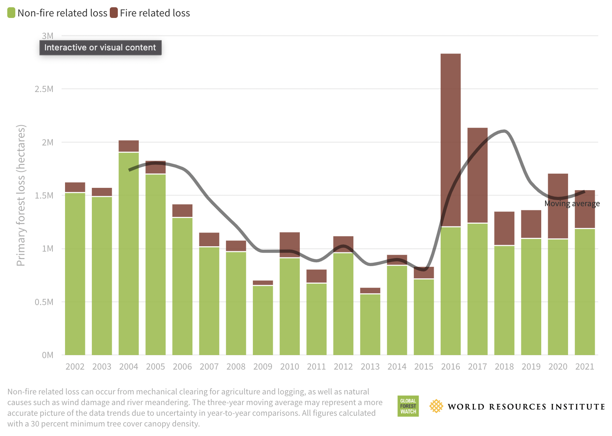
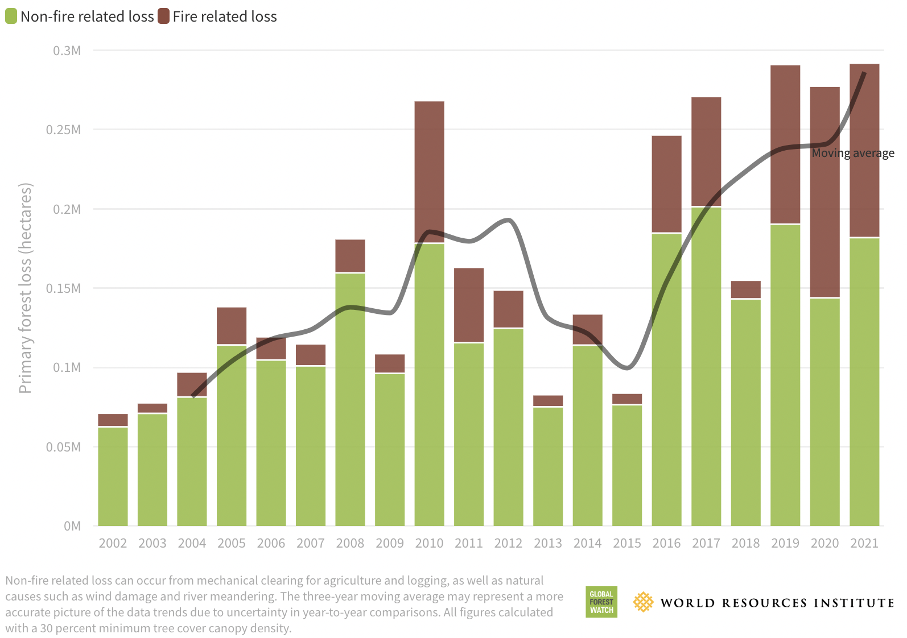

# Primary Forest Loss in Brazil and Bolivia, 2000–2021

**Source:** Weisse & Goldman, 2022

## What this indicator measures

Chart showing primary forest loss in Brazil and Bolivia between 2000 and 2021, distinguishing between fire-related losses (brown) and non-fire related losses (green).

## Key finding

The rate of primary forest loss in Brazil has been persistently high the past several years. Loss related to fires has fluctuated depending on the level of out-of-control forest fires, most recently with a spike in 2020 in the Amazon and the Pantanal. The past three years have seen consistently high rates of loss in Bolivia, with fires accounting for over a third of the loss each year.

## Visual

## Full reference

Weisse, M., & Goldman, L. (2022, April 28). What Happened to Forests in 2021? *Global Forest Watch and World Resources Institute*. https://www.globalforestwatch.org/blog/data-and-research/global-tree-cover-loss-data-2021/
