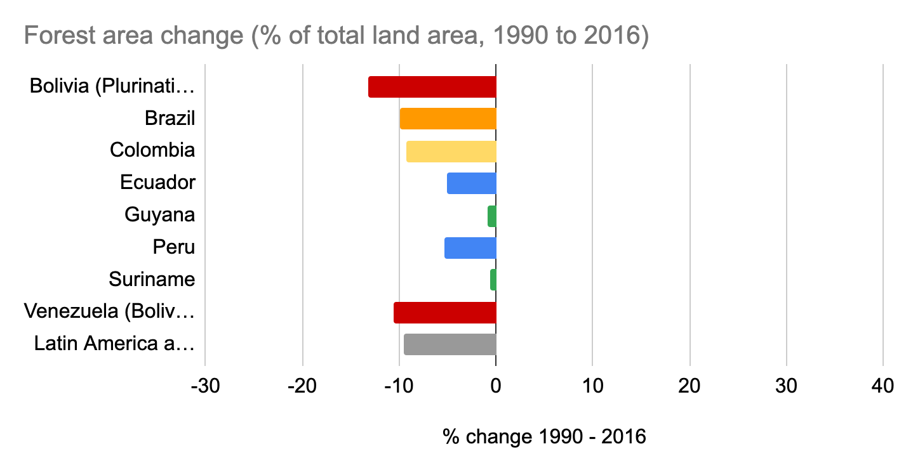

# Forest Area and Change, 1990–2016

**Source:** UN Statistics Department, 2020

## What this indicator measures

Percentage change in area under forest cover across Amazon countries between 1990 and 2016, based on HDRO calculations from World Development Indicators.

## Key finding

All countries had a net loss of forest between 1990 and 2016. Bolivia had the highest relative forest loss.

## Visual

## Full reference

UN Statistics Department. (2020). *Interactive Dashboard: Human Development and the Anthropocene | Human Development Reports*. Human Development Reports. https://hdr.undp.org/en/dashboard-human-development-anthropocene
