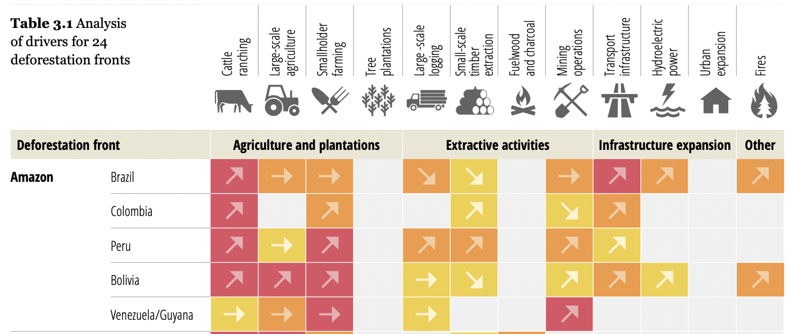
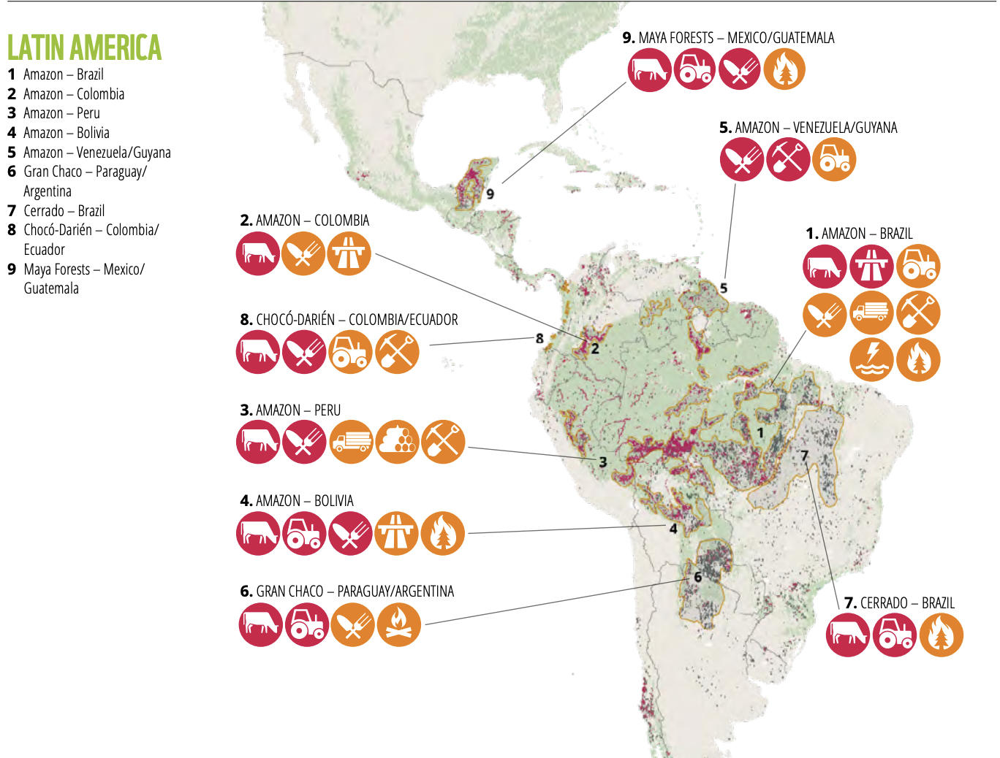
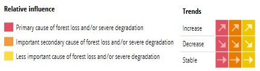

# Drivers of Deforestation in Latin America

**Source:** Pacheco et al., 2021

## What this indicator measures

Analysis of the primary drivers of deforestation and forest degradation across Amazon countries in Latin America, broken down by commodity and land use type.

## Key finding

Cattle ranching is a primary and increasing cause for deforestation and degradation in most of the Amazon, except Venezuela/Guyana. Smallholder farming is a primary cause in Peru, Bolivia and Venezuela/Guyana. Large-scale agriculture is a primary cause in Bolivia and a secondary cause in Brazil. Transport infrastructure is a primary cause in Brazil.

## Visual

## Full reference

Pacheco, P., K Mo, Dudley, N., Shapiro, A., Aguilar-Amuchastegui, N., Ling, P. Y., Anderson, C., & Marx, A. (2021). *Deforestation fronts: Drivers and responses in a changing world*. WWF International. https://wwfint.awsassets.panda.org/downloads/deforestation_fronts___drivers_and_responses_in_a_changing_world___full_report_1.pdf
