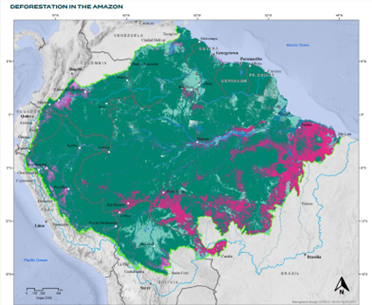
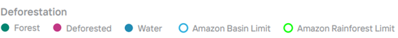

# Deforestation within the Amazon

**Source:** Science Panel for the Amazon, 2021

## What this indicator measures

Assessment of the current state of the Amazon by country, showing deforestation, high degradation, and remaining intact areas.

## Key finding

By 2020, 26% of the Amazon has undergone transformation: 20% of irreversible land use change (164 million ha) and 6% with high degradation (54 million ha). The remaining 74% (629 million hectares) still contains key priority areas with very high functionality, connectivity and biodiversity representativeness. 34% of the Brazilian Amazon has entered a process of transformation.

## Visual

## Full reference

Science Panel for the Amazon. (2021). *Amazon Assessment Report 2021*. UN Sustainable Development Solutions Network (SDSN). https://doi.org/10.55161/RWSX6527
