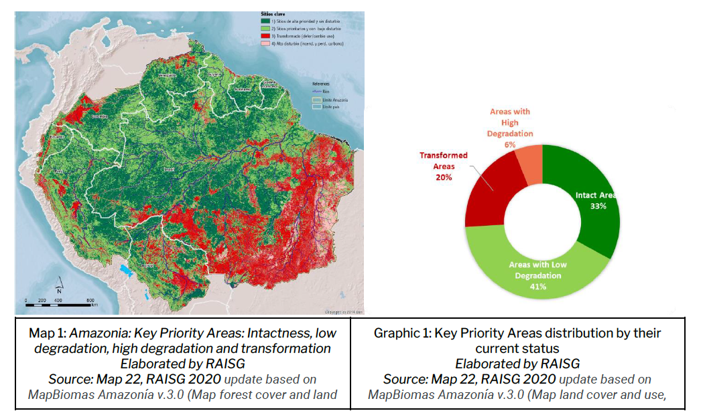
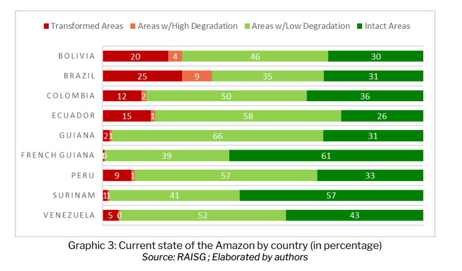

# Degradation in the Amazon, 2020

**Source:** Quintanilla et al., 2022

## What this indicator measures

Map and breakdown of Amazonia key priority areas: intactness, low degradation, high degradation, and transformation, by country.

## Key finding

By 2020, 26% of the Amazon has undergone transformation. Savannization is already a reality mainly in Brazil and Bolivia. Only 6% of the areas with high degradation are still subject to restoration. 34% of the Brazilian Amazon, 24% of the Bolivian Amazon, 16% in Ecuador, 14% in Colombia, and 10% in Peru have entered a process of transformation.

## Visual

## Full reference

Quintanilla, M., Guzman Leon, A., & Josse, C. (2022). *The Amazon against the clock*. COICA, RAISG and stand.earth.
