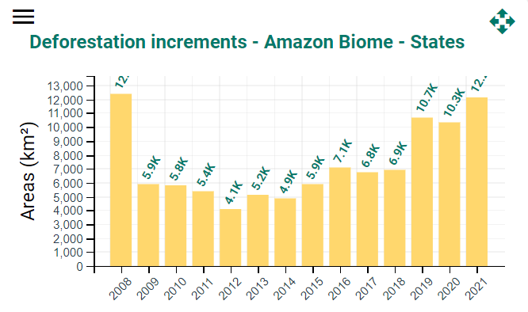

# Deforestation Rates — Amazon Biome, Brazil, 2008–2021

**Source:** INPE, 2022

## What this indicator measures

Annual deforestation rates calculated based on satellite monitoring of clear-cut deforestation since 1988 as part of the PRODES project. Data from 1998–2007 is not shown due to change in technology making it not comparable.

## Key finding

After years of lower rates, deforestation has picked up again since 2019. In 2021, primary forest loss by clear-cutting was the highest in the Amazon Legal since 2006. The Brazilian Amazon experienced on average 6,494 km2 of forest loss each year during the decade 2009–2018, but this suddenly leaped to 10,129 km2 in 2019 and 11,088 km2 in 2020.

## Visual

## Full reference

National Institute for Space Research, Earth Observation General Coordination (INPE). (2022). *PRODES: Deforestation of the Brazilian Amazon*. https://www.inpe.br/
