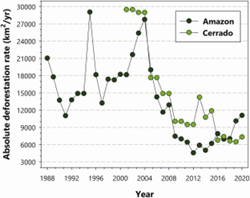

# Deforestation Rates — Amazon vs. Cerrado

**Source:** Schneider, Biedzicki de Marques et al., 2021

## What this indicator measures

Comparison of deforestation rates in the Brazilian Amazon and the Cerrado biome over time.

## Key finding

The Brazilian Amazon experienced a sudden leap in deforestation from an average of 6,494 km2 per year during 2009–2018 to 10,129 km2 in 2019 and 11,088 km2 in 2020.

## Visual

## Full reference

Schneider, M., Biedzicki de Marques, A. A., & Peres, C. A. (2021). Brazil's Next Deforestation Frontiers. *Tropical Conservation Science*, *14*, 194008292110204. https://doi.org/10.1177/19400829211020472
