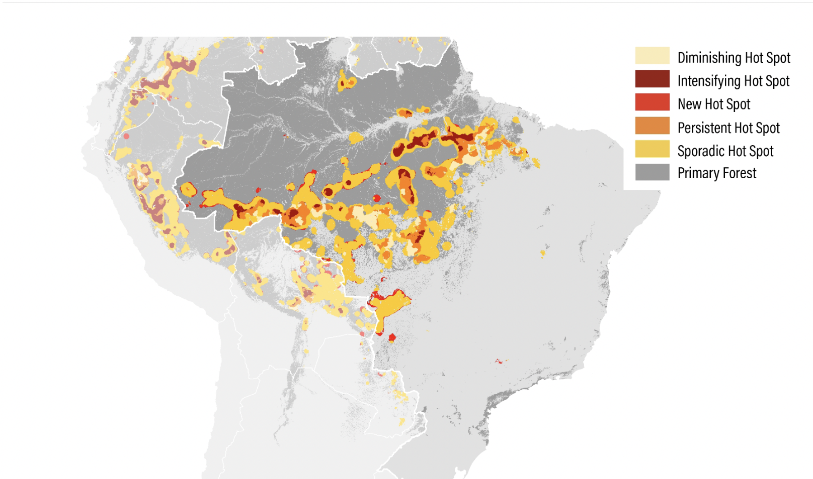
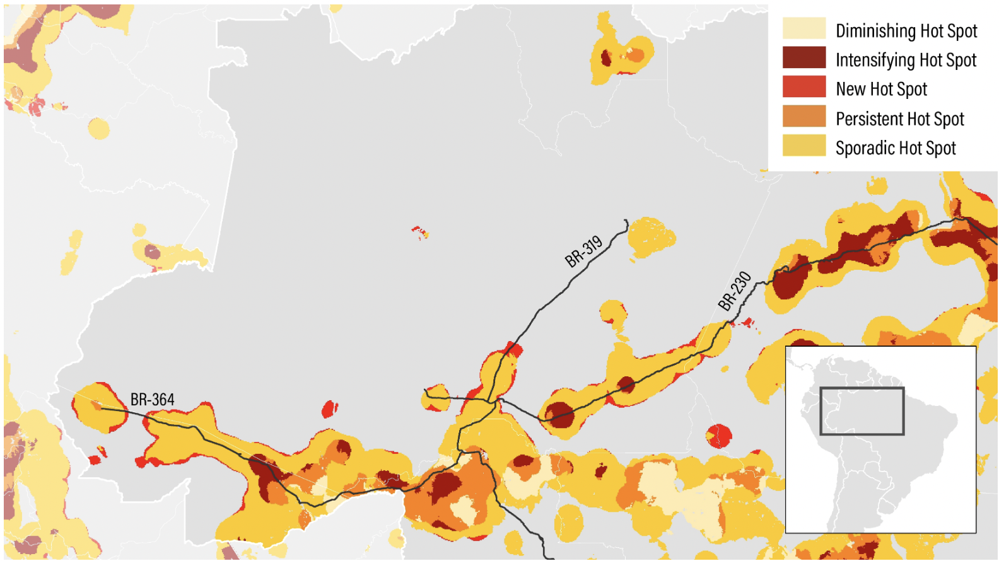

# Primary Forest Loss Hotspots in Brazil and Wider Amazon, 2002–2021

**Source:** Weisse & Goldman, 2022

## What this indicator measures

Maps showing hotspot areas of primary forest loss in Brazil and the wider Amazon basin, 2002–2021.

## Key finding

Hotspots of primary loss are located often along the brim of the Amazon and less in the core. They are also nested around new road development.

## Visual

## Full reference

Weisse, M., & Goldman, L. (2022, April 28). What Happened to Forests in 2021? *Global Forest Watch and World Resources Institute*. https://www.globalforestwatch.org/blog/data-and-research/global-tree-cover-loss-data-2021/
