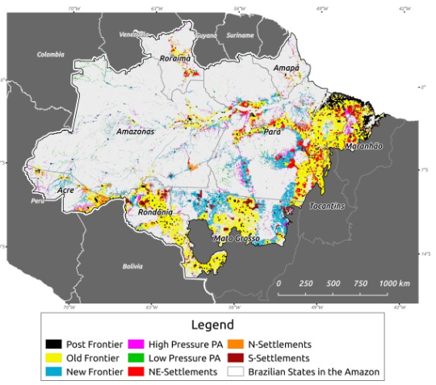

# Deforestation Frontiers in Brazilian Amazon, 2004–2015

**Source:** Schielein & Börner, 2018

## What this indicator measures

Analysis of recent frontier development in the Brazilian Amazon, characterizing the intensification of cattle ranching and increasing share of agricultural activities.

## Key finding

Recent frontier development is characterized by an intensification of cattle ranching, and an increasing share of agricultural activities in the production portfolio. The share of medium and large-scale deforestation declines at first, but rebounds during the observation period in all frontier types after 2012.

## Visual

## Full reference

Schielein, J., & Börner, J. (2018). Recent transformations of land-use and land-cover dynamics across different deforestation frontiers in the Brazilian Amazon. *Land Use Policy*, *76*, 81–94. https://doi.org/10.1016/j.landusepol.2018.04.052
