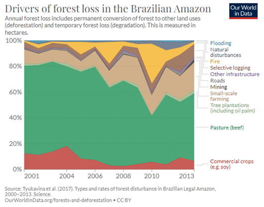

# Drivers of Forest Loss in the Brazilian Amazon

**Source:** Ritchie & Roser, 2021; Tyukavina et al., 2017

## What this indicator measures

Analysis of the main drivers of forest loss in the Brazilian Amazon, distinguishing between pasture, small-scale farming, large-scale agriculture, and other causes.

## Key finding

Pastures for beef are the main driver behind forest loss in the Brazilian Amazon, followed by small-scale farming. Indirect deforestation through spillover/replaced deforestation is not included in this data — which made up about half of soy-driven deforestation in the Mato Grosso.

## Visual

## Full reference

Ritchie, H., & Roser, M. (2021). Drivers of Deforestation. *Our World in Data*. https://ourworldindata.org/drivers-of-deforestation

Tyukavina, A., et al. (2017). Types and rates of forest disturbance in Brazilian Legal Amazon, 2000–2013. *Science Advances*, *3*(4), e1601047. https://doi.org/10.1126/sciadv.1601047
