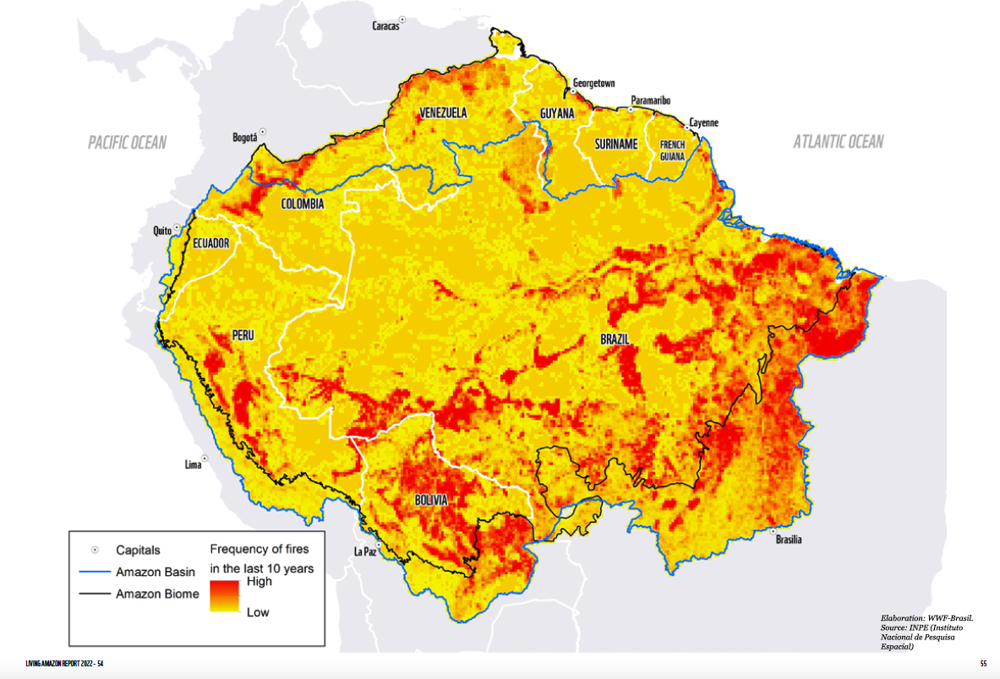

# Fire Frequency, 2012–2022

**Source:** Vergara et al., 2022

## What this indicator measures

Map showing fire frequency across the Amazon region from 2012 to 2022 (yellow = low frequency, red = high frequency).

## Key finding

33% of the Amazon fire outbreaks in 2019 were associated with intentional fires lit on private lands with CAR (Cadastro Ambiental Rural) and 18% in rural settlements. Intentional fires are associated with land speculation, cattle husbandry, and small farmers who practise rotational agriculture.

## Visual

## Full reference

Vergara, A., Arias, M., Gachet, B., Naranjo, L. G., Román, L., Surkin, J., & Tamayo, V. (2022). *Living Amazon Report 2022*. WWF.
