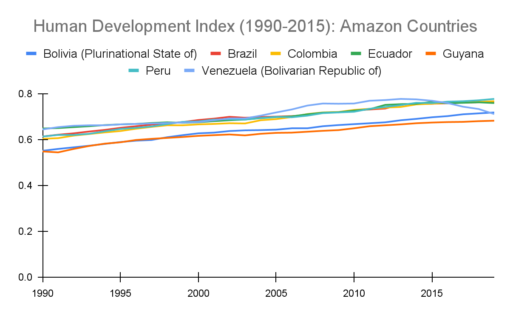

# Human Development Index, 1990–2018

**Source:** UN Statistics Department, 2020

## What this indicator measures

The HDI measures the average achievement in key dimensions of human development: (1) long and healthy life, (2) knowledge, and (3) decent standard of living.

## Key finding

With the exception of Venezuela, which shows a declining trend since 2014, all other Amazon countries are experiencing consistent and marginal improvement in their HDI.

## Visual

## Full reference

UN Statistics Department. (2020). *Interactive Dashboard: Human Development and the Anthropocene | Human Development Reports*. Human Development Reports. https://hdr.undp.org/en/dashboard-human-development-anthropocene
