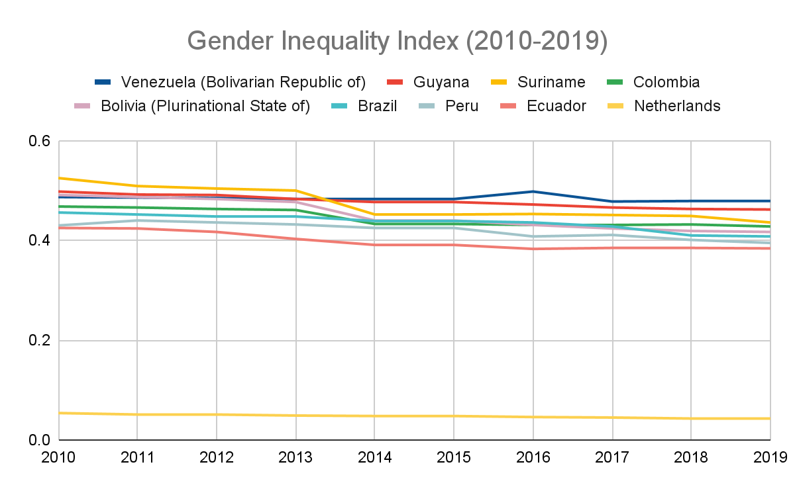

# Gender Inequality Index, 2010–2019

**Source:** UN Statistics Department, 2020

## What this indicator measures

Composite measure reflecting inequality in achievement between women and men in three dimensions: reproductive health, empowerment and the labor market. The lower the score the better.

## Key finding

All Amazon countries show gender inequality in the achievement of health, knowledge and standard of living, which results in a negative adjustment to human development trends when accounted for. The trend is not only quantitatively lower but shows less overall improvement over time. Suriname showed the largest improvement (17%), followed by Bolivia (15%) and Brazil (11%).

## Visual

## Full reference

UN Statistics Department. (2020). *Interactive Dashboard: Human Development and the Anthropocene | Human Development Reports*. Human Development Reports. https://hdr.undp.org/en/dashboard-human-development-anthropocene
