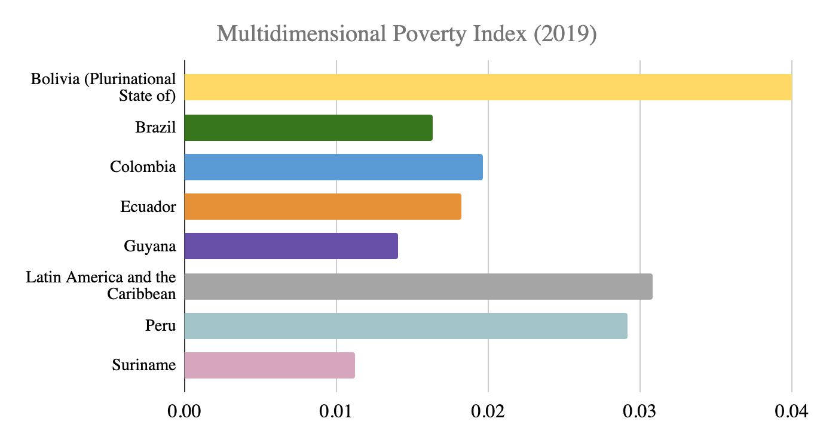

# The Multidimensional Poverty Index, 2019

**Source:** Alkire et al., 2020

## What this indicator measures

Tracks the percentage of the population that is multidimensionally poor, adjusted by the intensity of the deprivations. The lower the score the better.

## Key finding

Not specified in available text — visual required for key finding.

## Visual

## Full reference

Alkire, S., Kovesdi, F., Mitchell, C., Pinilla-Roncancio, M., & Scharlin-Pettee, S. (2020). *Changes over Time in the Global Multidimensional Poverty Index* (MPI Methodological Note 50). OPHI, University of Oxford. https://hdr.undp.org/sites/default/files/2020_mpi_report_en.pdf
