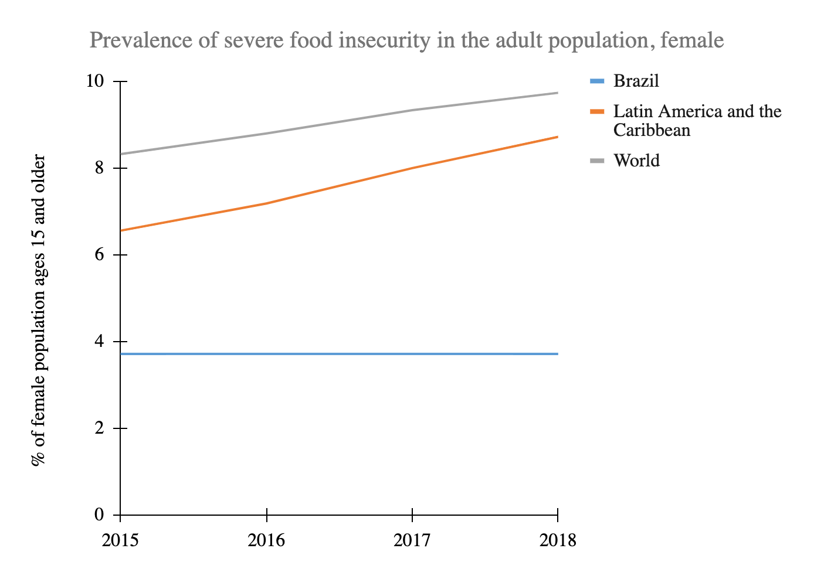

# Prevalence of Food Insecurity in the Adult Population (Female), 2015–2018

**Source:** UN Statistics Department, 2020

## What this indicator measures

Percentage of people in the population who have experienced food insecurity at severe levels, measured on the Food Insecurity Experience Scale. Only data for Brazil available.

## Key finding

Brazil seems to have stable food security for the female population during this period.

## Visual

## Full reference

UN Statistics Department. (2020). *Interactive Dashboard: Human Development and the Anthropocene | Human Development Reports*. Human Development Reports. https://hdr.undp.org/en/dashboard-human-development-anthropocene
